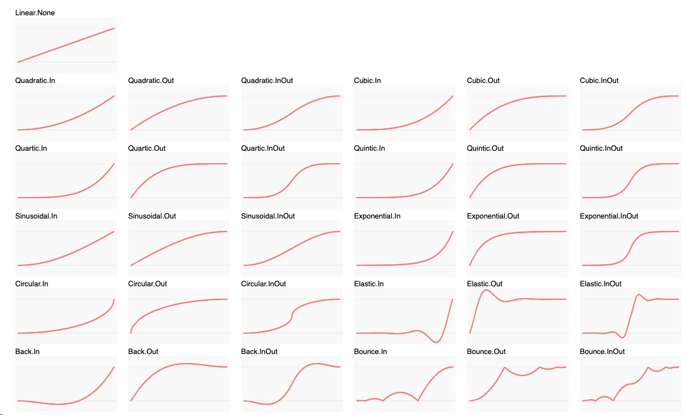

# 补间动画

补间动画使用开源插件 [tween.js](https://github.com/tweenjs/tween.js) 实现。

## animation

创建一个补间动画

:::warning 献给不了解模型动画的读者：
该函数多用来实现一些简单空间属性的补间动画，例如：一个模型具有原始位置（source），你想让它移动到某处（target），这样的简单动画使用该函数就很容易做到。但是它无法像 [模型动画](https://baike.baidu.com/item/%E4%B8%89%E7%BB%B4%E8%AE%A1%E7%AE%97%E6%9C%BA%E5%8A%A8%E7%94%BB/3731278?fromtitle=%E6%A8%A1%E5%9E%8B%E5%8A%A8%E7%94%BB&fromid=24027679&fr=aladdin) 一样灵活与强大，例如：一个游戏人物模型的舞蹈动画，它应该是由建模师在建模时完成，使用文档的 [动画播放](./model.html#playmodelanimation) 方法来播放。
:::

### 样例：

<Docs-Iframe src="animation/createAnimation.html" />

### 定义：

```ts
type AnimationMode =
  | 'Linear.None'
  | 'Quadratic.In' | 'Quadratic.Out' | 'Quadratic.InOut'
  | 'Cubic.In' | 'Cubic.Out' | 'Cubic.InOut'
  | 'Quartic.In' | 'Quartic.Out' | 'Quartic.InOut'
  | 'Quintic.In' | 'Quintic.Out' | 'Quintic.InOut'
  | 'Sinusoidal.In' | 'Sinusoidal.Out' | 'Sinusoidal.InOut'
  | 'Exponential.In' | 'Exponential.Out' | 'Exponential.InOut'
  | 'Circular.In' | 'Circular.Out' | 'Circular.InOut'
  | 'Elastic.In' | 'Elastic.Out' | 'Elastic.InOut'
  | 'Back.In' | 'Back.Out' | 'Back.InOut'
  | 'Bounce.In' | 'Bounce.Out' | 'Bounce.InOut'

interface AnimationOptions {
  duration?: number
  delay?: number
  repeat?: number | boolean
  mode?: AnimationMode
  yoyo?: boolean;
}

function Animation<PropType>(
  source: PropType,
  target: PropType,
  options: AnimationOptions = {},
  onUpdate?: (source: PropType, tween: Tween<PropType>) => void,
  onStart?: (tween: Tween<PropType>) => void
) => Promise<void>
```

### 用法：

```js
let tween;

ssp
  .animation(
    // source
    model.position,
    // target
    { x: 2000, y: 2000, z: 2000 },
    // options
    {
      duration: 3000,
      delay: 1000,
      repeat: 1,
    },
    // onUpdate
    (source, _tween) => {
      console.log('onUpdate', source, _tween);
    },
    // onStart
    (_tween) => {
      tween = _tween;
      console.log('onStart', _tween);
    }
  )
  .then(() => {
    // 动画结束
  })
  .catch(() => {
    // 动画终止了
  });

// 暂停
tween.pause();

// 恢复
tween.resume();

// 停止
tween.stop();
```

::: warning 注意
调用 `tween.stop` 方法后，状态会变为 `reject`
:::

### 参数：

#### source

- **描述:** 动画源目标
- **必填:** <Base-RequireIcon :isRequire="true"/>
- **类型:** any

#### target

- **描述:** 动画到达目标
- **必填:** <Base-RequireIcon :isRequire="true"/>
- **类型:** any

#### options

- **描述:** 动画可配置项
- **必填:** <Base-RequireIcon :isRequire="false"/>
- **类型:** AnimationOptions

##### AnimationOptions

<Docs-Table 
    :data="[
      {
        prop: 'duration', desc: '补间执行时长（ms）', type: 'number', require: false, default: '1000'
      },
      {
        prop: 'delay', desc: '补间开始前延时（ms）', type: 'number', require: false, default: '0'
      },
      {
        prop: 'repeat', desc: '动画循环', type: 'number | boolean', require: false, default: 'false'
      },
      {
        prop: 'mode', desc: '动画模式', type: 'AnimationMode', require: false, default: 'Linear.None'
      },
      {
        prop: 'yoyo', desc: '反向执行，需与 repeat 一起使用', type: 'boolean', require: false, default: 'false'
      }
    ]"
/>

##### AnimationMode [ 链接](http://sole.github.io/tween.js/examples/03_graphs.html)



### 样例：

<Docs-Iframe src="animation/animationModeEnum.html" />

#### onUpdate

- **描述:** 动画实时更新回调
- **必填:** <Base-RequireIcon :isRequire="false"/>
- **类型:** `(source: PropType, tween: Tween<PropType>) => void`

#### onStart

- **描述:** 动画开始时回调
- **必填:** <Base-RequireIcon :isRequire="false"/>
- **类型:** `(tween: Tween<PropType>) => void`
