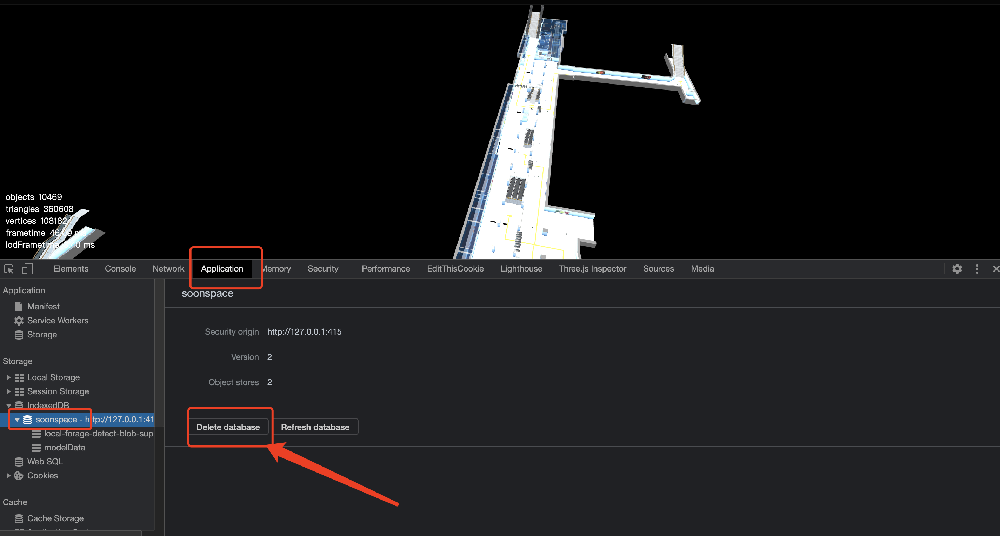

# 通用模型

::: tip 支持格式
支持的格式有 `sbm、gltf (glb)、fbx、sbmx`
:::

## loadModel

加载 `model` 模型。

### 样例：

<Docs-Iframe src="model/loadGltf.html" />

### 定义：

```ts
interface ModelInfo extends BaseObject3DInfo, ObjectEvents<Model> {
  url: string;
}

function loadModel(modelInfo: ModelInfo): Promise<Model>;
```

### 用法：

```js
ssp
  .loadModel(
    // modelInfo
    {
      id: 'xx',
      name: 'xx',
      url: 'xx/x.fbx',
      level: {
        max: 1000,
        min: null,
      },
      position: { x: 0, y: 0, z: 0 },
      rotation: { x: 0, y: 0, z: 0 },
      scale: { x: 2, y: 2, z: 2 },
      onClick(e) {
        /**
         * 对象的独立事件触发后，默认不传播（类似 DOM 的事件冒泡）到全局事件，
         * 调用 eventPropagation 方法通知事件继续传播到全局。
         *
         * warn：
         *  在 **非箭头函数** 中参数 e 与 this 的指向都是当前模型对象，
         *  在 *箭头函数** 参数 e 依然是模型对象，但 this 指向会发生改变。
         */
        this.eventPropagation();

        console.log('模型自身的点击事件触发', this);
      },
      onDblClick: (e) => {
        /**
         * 这里模拟在 **箭头函数** 中
         */
        e.eventPropagation();

        console.log('模型自身的双击事件触发', e);
      },
      userData: {},
    }
  )
  .then((model) => console.log(model))
  .catch((err) => console.error(err));
```

### 参数：

#### modelInfo

- **描述:** 实例 `Model` 对象所需信息
- **类型:** ModelInfo
- **必填:** <Base-RequireIcon :isRequire="true"/>

##### ModelInfo

<Docs-Table
    :data="[
      { prop: 'id', desc: '唯一ID', type: 'string | number', require: true, default: '' },
      { prop: 'name', desc: '名称', type: 'string', require: false, default: '' },
      { prop: 'url', desc: '资源路径', type: 'string', require: true, default: '' },
      { prop: 'level', desc: '显示层级范围', type: 'Level', require: false, default: '{ max: null, min: null }', link: '../guide/types.html#level' },
      { prop: 'visible', desc: '是否可见', type: 'boolean', require: false, default: 'true' },
      { prop: 'position', desc: '位置坐标', type: 'Position', require: false, default: '{ x: 0, y: 0, z: 0 }', link: '../guide/types.html#position' },
      { prop: 'rotation', desc: '旋转弧度', type: 'Rotation', require: false, default: '{ x: 0, y: 0, z: 0 }', link: '../guide/types.html#rotation' },
      { prop: 'scale', desc: '缩放比例', type: 'Scale', require: false, default: '{ x: 1, y: 1, z: 1 }', link: '../guide/types.html#scale' },
      { prop: 'userData', desc: '用户数据', type: 'any', require: false, default: '{}' },
      { prop: 'onClick', desc: '左键单击事件', type: '(object: Model) =&gt; void', require: false, default: 'null' },
      { prop: 'onDblClick', desc: '左键双击事件', type: '(object: Model) =&gt; void', require: false, default: 'null' },
      { prop: 'onRightClick', desc: '右键单击事件', type: '(object: Model) =&gt; void', require: false, default: 'null' },
      { prop: 'onLoad', desc: '加载完成事件', type: '(object: Model) =&gt; void', require: false, default: 'null' },
    ]"
/>

## cloneModel

克隆 Model 模型

### 定义:

```ts
interface CloneModelInfo extends Omit<ModelInfo, 'url'> {}

function cloneModel(
  model: Model,
  modelInfo: CloneModelInfo,
  parent?: BaseObject3D | null
): Promise<Model>;
```

### 用法:

```js
const clonedModel = await ssp.cloneModel(model, {
  id: 'clone_model',
  position: {
    x: 100,
    y: 0,
    z: 0,
  },
});
```

### 参数:

#### model

- **描述:** Model 对象
- **类型:** `Model`
- **必填:** <Base-RequireIcon />

#### modelInfo

同 [ModelInfo](#modelinfo), 但不需要字段 `url`。

#### parent

- **描述:** 将 `Model` 克隆到的 `parent` 下
- **类型:** `Model`
- **必填:** <Base-RequireIcon :isRequire="false" />

## getModelById <Base-Deprecated />

通过 `id` 查找

### 定义：

```ts
function getModelById(id: ModelInfo['id']): Model | null;
```

### 用法：

```js
const model = ssp.getModelById('xxx');
```

:::warning 弃用警告
请使用 [`getObjectById`](./object.html#getobjectbyid) 替代
:::

## getModelByName <Base-Deprecated />

通过 `name` 查找

### 定义：

```ts
function getModelByName(name: string): Model[];
```

### 用法：

```js
const modelList = ssp.getModelByName('xxx');
```

:::warning 弃用警告
请使用 [`getObjectByName`](./object.html#getobjectbyname) 替代
:::

## getAllModel

获取所有 `Model` 对象

### 定义：

```ts
function getAllModel(): Model[];
```

### 用法：

```js
const allModelList = ssp.getAllModel();
```

## getModelByUserDataProperty <Base-Deprecated />

通过 `userData` 属性查找

### 定义：

```ts
function getModelByUserDataProperty(
  propNameOrFindFunc: string | UserDataPropertyFindFunc,
  value?: any
): Model[];
```

### 用法：

```js
const modelList = ssp.getModelByUserDataProperty('propKey'， 'propVal')
// or
const modelList = ssp.getModelByUserDataProperty(item => item['itemPropKey'] === 'itemPropVal')
```

### 参数：

#### propNameOrFindFunc

- **描述:** `userData` 内属性名 或 `find` 函数
- **类型:** string | function
- **必填:** <Base-RequireIcon :isRequire="true"/>

#### propValue

- **描述:** `userData` 内属性值。
- **类型:** any
- **必填:** <Base-RequireIcon :isRequire="false"/>

::: tip find 函数使用场景

```js
model.userData = {
  people: {
    name: 'xiaoming',
    age: 18,
  },
};
const modelList = ssp.getModelByUserDataProperty(
  (userData) => userData?.people?.name === 'xiaoming'
);
```

:::

:::warning 弃用警告
请使用 [`getObjectByUserDataProperty`](./object.html#getobjectbyuserdataproperty) 替代
:::

## removeModelById <Base-Deprecated />

通过 `id` 移除

### 定义：

```ts
function removeModelById(id: ModelInfo['id']): boolean;
```

### 用法：

```js
ssp.removeModelById('xxx');
```

:::warning 弃用警告
请使用 [`removeObjectById`](./object.html#removeobjectbyid) 替代
:::

## loadModelToGroup

加载 `model` 到一个组内。

### 定义：

```ts
function loadModelToGroup(
  groupInfo: GroupInfo,
  modelInfoList: ModelInfo[]
): Promise<Group>;
```

### 用法：

```js
ssp
  .loadModelToGroup(
    // groupInfo
    {
      id: 'firstModelGroup',
      name: 'name_firstModelGroup',
      // ...
    },
    // modelInfoList
    [modelInfo1, modelInfo2, modelInfo3]
  )
  .then((group) => console.log(group));
```

### 参数

#### groupInfo

- **描述:** 实例组对象所需信息
- **类型:** [GroupInfo](./sbm.html#groupinfo)
- **必填:** <Base-RequireIcon :isRequire="true"/>

#### modelInfoList

- **描述:** `modelInfo` 集合
- **类型:** [modelinfo](#modelinfo)[]
- **必填:** <Base-RequireIcon :isRequire="true"/>

## createGroupForModel <Base-Deprecated />

为 `model` 提前创建一个空组。
::: tip 使用场景
与 `loadModelToGroup` 不同，有些时候可能你还没有具体的 `modelInfo` 数据，但你想提前创建一个批量管理的空组，当有数据时再使用 [addModelForGroup](#addmodelforgroup) 插入。
:::

### 定义：

```ts
function createGroupForModel(groupInfo: GroupInfo): Group;
```

### 用法：

```js
ssp.createGroupForModel({
  id: 'firstModelGroup',
  name: 'name_firstModelGroup',
  // ...
});
```

### 参数

#### groupInfo

- **描述:** 实例组对象所需信息
- **类型:** [GroupInfo](./sbm.html#groupinfo)
- **必填:** <Base-RequireIcon :isRequire="true"/>

:::warning 弃用警告
请使用 [`createGroup`](../guide/objectGroup.html#creategroup) 替代
:::

## addModelForGroup

向一个已经存在的组内添加 `model` 对象。

### 定义：

```ts
function addModelForGroup(
  groupId: GroupInfo['id'],
  modelInfoList: ModelInfo[]
): Promise<Group | null>;
```

### 用法：

```js
ssp
  .addModelForGroup(
    // groupId
    'firstModelGroup',
    // modelInfoList
    [modelInfo4, modelInfo5],
    // onProgress
    (progress) => console.log('进度信息：', progress)
  )
  .then((group) => console.log(group));
```

### 参数

#### groupId

- **描述:** 组 `id`
- **类型:** [groupId](./sbm.html#groupinfo)[‘id’]
- **必填:** <Base-RequireIcon :isRequire="true"/>

#### modelInfoList

- **描述:** `modelInfo` 集合
- **类型:** [modelinfo](#modelinfo)[]
- **必填:** <Base-RequireIcon :isRequire="true"/>

## getModelGroupById <Base-Deprecated />

通过 `id` 查找 `model` 组

### 定义：

```ts
function getModelGroupById(id: GroupInfo['id']): Group | null;
```

### 用法：

```js
const group = ssp.getModelGroupById('firstModelGroup');
```

:::warning 弃用警告
请使用 [`getObjectById`](./object.html#getobjectbyid) 替代
:::

## getModelGroupByName <Base-Deprecated />

通过 `name` 查找 `model` 组

### 定义：

```ts
function getModelGroupByName(name: string): Group[];
```

### 用法：

```js
const groupList = ssp.getModelGroupByName('name_firstModelGroup');
```

:::warning 弃用警告
请使用 [`getObjectByName`](./object.html#getobjectbyname) 替代
:::

## getAllModelGroup <Base-Deprecated />

获取所有 `Model` 对象组

### 定义：

```ts
function getAllModelGroup(): Group[];
```

### 用法：

```js
const allModelGroupList = ssp.getAllModelGroup();
```

:::warning 弃用警告
请使用 [`getAllGroup`](../guide/objectGroup.html#getallgroup) 替代
:::

## removeModelGroupById <Base-Deprecated />

通过 `id` 移除 `model` 组

### 定义：

```ts
function removeModelGroupById(id: GroupInfo['id']): boolean;
```

### 用法：

```js
const isRemoveSuccess = ssp.removeModelGroupById('firstModelGroup');
```

:::warning 弃用警告
请使用 [`removeObjectById`](./object.html#removeobjectbyid) 替代
:::

## clearModel

清除当前场景内所有 `model` 对象。

### 定义：

```ts
function clearModel(): void;
```

### 用法：

```js
ssp.clearModel();
```

## showAllModel

显示当前场景内所有 `model` 对象。

### 定义：

```ts
function showAllModel(): void;
```

### 用法：

```js
ssp.showAllModel();
```

## hideAllModel

隐藏当前场景内所有 `model` 对象。

### 定义：

```ts
function hideAllModel(): void;
```

### 用法：

```js
ssp.hideAllModel();
```

## playModelAnimation

播放模型动画。

### 定义：

```ts
interface ModelAnimationFindFunc {
  (
    animation: AnimationClip,
    index: number,
    animations: AnimationClip[]
  ): boolean;
}

function playModelAnimation(
  model: Model,
  animation: number | AnimationClip | ModelAnimationFindFunc
): AnimationAction | undefined;
```

### 用法：

```js
const model = ssp.getModelById('xxxx');

// number
ssp.playModelAnimation(model, 0);
// or AnimationClip
ssp.playModelAnimation(model, model.animations[0]);
// or ModelAnimationFindFunc
ssp.playModelAnimation(model, (itemAnimation) => itemAnimation.name === 'run');
```

### 参数：

#### model

- **描述:** 模型对象
- **类型:** [Model](../sceneObject/Model.html)
- **必填:** <Base-RequireIcon :isRequire="true"/>

#### animation

- **描述:** 动画信息
- **类型:** number | [AnimationClip](https://threejs.org/docs/index.html?q=AnimationClip#api/en/animation/AnimationClip) | ModelAnimationFindFunc
- **必填:** <Base-RequireIcon :isRequire="true"/>

## stopModelAnimation

停止模型动画。

### 定义：

```ts
function stopModelAnimation(
  model: Model,
  animation: number | AnimationClip | ModelAnimationFindFunc
): void;
```

### 用法：

```js
const model = ssp.getModelById('xxxx');

// number
ssp.stopModelAnimation(model, 0);
// or AnimationClip
ssp.stopModelAnimation(model, model.animations[0]);
// or ModelAnimationFindFunc
ssp.stopModelAnimation(model, (itemAnimation) => itemAnimation.name === 'run');
```

### 参数：

#### model

- **描述:** 模型对象
- **类型:** [Model](../sceneObject/Model.html)
- **必填:** <Base-RequireIcon :isRequire="true"/>

#### animation

- **描述:** 动画信息
- **类型:** number | [AnimationClip](https://threejs.org/docs/index.html?q=AnimationClip#api/en/animation/AnimationClip) | ModelAnimationFindFunc
- **必填:** <Base-RequireIcon :isRequire="true"/>

## setModelDracoDecoderPath

设置模型的 DRACO 解压库路径

### 定义：

```ts
function setModelDracoDecoderPath(path: string): void;
```

### 用法：

```js
ssp.setModelDracoDecoderPath('/examples/js/libs/draco/');
```


## setTexture

给 mesh 设置纹理贴图，可设置 图片、Cavans 元素、视频 等。

备注：它会恢复原材质中除了贴图之外的所有配置，以保证效果尽可能与原来材质一样。

### 定义：

```ts
setTexture ( mesh: Mesh, image: string | HTMLImageElement | HTMLCanvasElement | HTMLVideoElement, options?: SetTextureOptions ): Texture
```

### 用法：

```js
ssp.setTexture(mesh,"http://xx.com/xx.png");
```

## createFindObjectsInBoxNearPosition

创建用于 查找位置附近的 box 空间范围内的物体 的查找器。

当你来查找棱某个位置处 上、下、左、右、前、后 一定距离范围内的某类模型时，可以使用该方法。

### 定义：

```ts
/**
 * 位置附近的对象查找器
 * @param position - 指定查找的位置
 * @returns 所有包含在指定空间的对象
 */
export type FindObjectsNearPosition = ( position: Vector3 ) => Object3D[]

/**
 * 盒子空间
 */
interface BoxSpace {
  top: number;
  bottom: number;
  left: number;
  right: number;
  front: number;
  back: number;
}


createFindObjectsInBoxNearPosition ( boxSpace: BoxSpace, objects: Object3D[] ): FindObjectsNearPosition
```

### boxSpace
通过上、下、左、右、前、后来描述查找区域。

- 类型：`BoxSpace`

### objects
被查找的空间对象。只会从这些对象中进行查找。

- 类型：`Object3D`

### 用法：

```js
//合建一个查找器，需要指定查找的区域 和 从哪些对象中进行查找
const findObjectsNearPosition = ssp.createFindObjectsInBoxNearPosition({
  top: 20,
  bottom: 20,
  left: 30,
  right: 40,
  front: 50,
  back: 60,
},objArr);

// 使用查找器查找指定位置附近区域的对象
const nearObjs = findObjectsNearPosition({x:100,y:100,z:100})
```


## createFindObjectsInSphereNearPosition

创建用于 查找位置附近的球形区域范围内的物体 的查找器

当你来查找某个位置处指定半径范围内的某类模型时，可以使用该方法。

### 定义：

```ts
/**
 * 位置附近的对象查找器
 * @param position - 指定查找的位置
 * @returns 所有包含在指定空间的对象
 */
export type FindObjectsNearPosition = ( position: Vector3 ) => Object3D[]

/**
 * 创建用于 查找位置附近的球形区域范围内的物体 的查找器
 * 
 * @param radius - 描述查找半径
 * @param objects - 所有需要被查找的对象
 * @returns 用于查找的函数
 */
createFindObjectsInSphereNearPosition ( radius: number, objects: Object3D[] ): FindObjectsNearPosition
```

### radius
查找区域的半径

- 类型：`number`

### objects
被查找的空间对象。只会从这些对象中进行查找。

- 类型：`Object3D`

### 用法：

```js
//合建一个查找器，需要指定查找的区域 和 从哪些对象中进行查找
const findObjectsNearPosition = ssp.createFindObjectsInSphereNearPosition(20,objArr);

// 使用查找器查找指定位置附近区域的对象
const nearObjs = findObjectsNearPosition({x:100,y:100,z:100})
```


## createFindObjectsNearPath

创建用于 查找路径附近的范围内的物体 的查找器

当你来查找路径周围指定半径范围内的某类模型时，可以使用该方法。

### 定义：

```ts
/**
 * 查找附近的对象
 * @param objs - 所有需要被查找的对象
 */
export type FindNearbyObjects = ( objs: Object3D[] ) => Object3D[]

/**
 *  创建用于 查找路径附近的范围内的物体 的查找器
 * 
 * @param points - 描述路径的点
 * @param radius - 描述查找半径
 * @returns 用于查找的函数
 */
createFindObjectsNearPath ( points: Vector3[], radius: number ): FindNearbyObjects
```

### points
组成路径的顶点

- 类型：`Vector3[]`

### radius
路径附近的查找区域的半径

- 类型：`number`

### 用法：

```js
//合建一个查找器，需要指定查找的区域 和 和被查找的路径
const findNearbyObjects = ssp.createFindObjectsNearPath([
  {x:0,y:0,z:0},
  {x:10,y:0,z:0},
  {x:10,y:10,z:0},
  {x:10,y:10,z:10},
],20);

// 使用查找器查找指定的对象集中进行查找
const nearObjs = findNearbyObjects({x:100,y:100,z:100})
```

## clearIdb

清空本地 indexedDB 模型缓存数据

### 定义:

```ts
function clearIdb(): Promise<void>;
```

### 用法：

```js
ssp.clearIdb().then(() => {
  console.log('本地数据已清空!!!');
});
```

#### 手动清除 indexedDB 缓存


