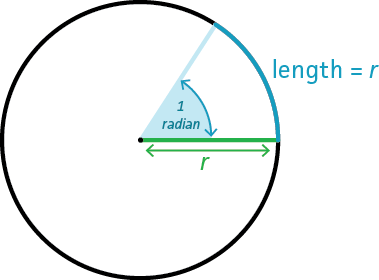

# FAQ

## 如何接入外部数据?

### Ajax

> 这里使用 `fetch` API 请求接口, 你可以使用任何你喜欢的 ajax 请求库

```js
ssp.loadSbm(modelinfo).then((modelObj) => {
    // 模型加载完毕
    fetch('https://xxx.com')
    .(res => res.json())
    .(data => {
        // 你可以在这里操作模型
        if(condition){
            ssp.highlightShow(modelObj)
        }
    })
})
```

### WebSocket

```js
let webSocket = null;

ssp.loadSbm(modelinfo).then((modelObj) => {
  // 模型加载完毕
  const webSocket = new WebSocket('wss://xxx.com');
  webSocket.onmessage((data) => {
    // 你可以在这里操作模型
    if (condition) {
      ssp.highlightShow(modelObj);
    }
  });
  webSocket.onclose = function(evt) {
    console.log('websoket关闭...');
    webSocket = null;
  };
});
```

### MQTT

> 使用 `MQTT.js` 与服务端建立连接, 具体如何集成请参考 [MQTT.js](https://github.com/mqttjs/MQTT.js)

```js
// 温度模拟数据
const mockTemperatureData = ['10', '25', '32', '40', '6', '20'];
let client = null;

ssp.loadSbm(sbmsInfo).then(([sensorModel]) => {
  // 模型加载完成
  ssp.flyToObj(sensorModel);

  /** ******************* 以下为MQTT数据对接 ********************/
  // 测试的MQTT服务器文档参考 http://test.mosquitto.org/
  // 模拟设备端每隔3秒会向服务器 /sensor/dev 发送一条温度数据
  // 客户端订阅了 /sensor/dev 主题
  // 也可以通过其他MQTT客户端向服务器发送 /sensor/dev 主题的消息，验证MQTT服务
  client = mqtt.connect('ws://test.mosquitto.org:8080');

  client.on('connect', function() {
    client.subscribe('/sensor/dev', function(err) {
      if (!err) {
        // 这里模拟设备端向服务器发送温度数据
        setInterval(() => {
          client.publish(
            '/sensor/dev',
            mockTemperatureData[
              Math.floor(mockTemperatureData.length * Math.random())
            ]
          );
        }, 3000);
      }
    });
  });
  client.on('message', function(topic, payload) {
    // 返回 Array Buffer
    // 将数据转换为 number
    const data = +payload.toString();
    // 温度 >= 25℃ 就告警
    // 在这里操作模型
    if (data >= 25) {
      ssp.emissiveShow(sensorModel);
    } else {
      ssp.unEmissiveShow(sensorModel);
    }
  });
});
```

## 角度和弧度的区别是什么？

角度（Degrees）和弧度（Radians）都是由于表示角（Angle）的方法。
<br>
参考文献：[https://www.expii.com/t/what-are-degrees-and-radians-10596](https://www.expii.com/t/what-are-degrees-and-radians-10596)

### 角度

在生活中角度较为常见，**通常 180° 表示半圈，360° 表示一圈**。


### 弧度

但在图形编程中弧度较为常见，**通常 π 表示半圈，2π 表示一圈**。

弧度表示：圆的任意俩条半径形成的内夹角所对应 **圆周长与半径** 比。



### 转换

**1° = π/180**

**10° = π/18**

**30° = π/6**

**45° = π/4**

**90° = π/2**

**180° = π**

**360° = 2π**
