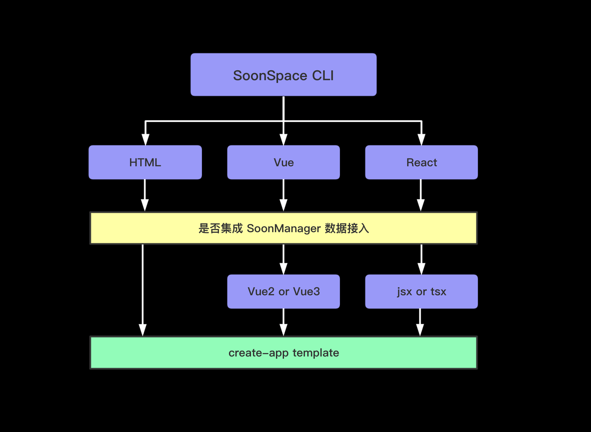

# 快速上手

## 快速搭建

使用 `@soonspacejs/create-app` 快速搭建项目。

你可以选择 `Vue`、`React`或者是 `Html`，并且我们提供了集成 [`soonmanager-sync`](../plugin/soonmanager-sync.html) 选项。

通过以下命令创建一个模板：

```sh
npx @soonspacejs/create-app ssp-pro
```

`@soonspacejs/create-app` 的简要架构:



## 手动搭建

#### node

```bash
# 安装
npm install soonspacejs@next -S
# 或者
yarn add soonspacejs@next -S
```

#### CDN

[https://unpkg.com/soonspacejs/dist/index.js](https://unpkg.com/soonspacejs/dist/index.js)

### 在 html 中使用

```html
<!DOCTYPE html>
<html lang="en">
  <head>
    <meta charset="UTF-8" />
    <meta name="viewport" content="width=device-width, initial-scale=1.0" />
    <meta http-equiv="X-UA-Compatible" content="ie=edge" />
    <title>SoonSpace Example</title>
  </head>

  <body>
    <div id="view"></div>

    <script src="https://unpkg.com/soonspacejs@next/dist/index.js"></script>
    <script>
      const ssp = new SoonSpace({
        // 绑定场景的元素选择器
        el: '#view',
        // 初始配置项
        options: {
          // 是否显示网格
          showGrid: true,
        },
        // 场景交互事件
        events: {
          // 模型点击
          modelClick({ target, currentTarget }) {
            console.log(target, currentTarget);
          },
        },
      });
    </script>
  </body>
</html>
```

### 在 Vue 中使用

[vue-soonspace](../plugin/vue-soonspace.html)

### 在 React 中使用

[react-soonspace](../plugin/react-soonspace.html)
