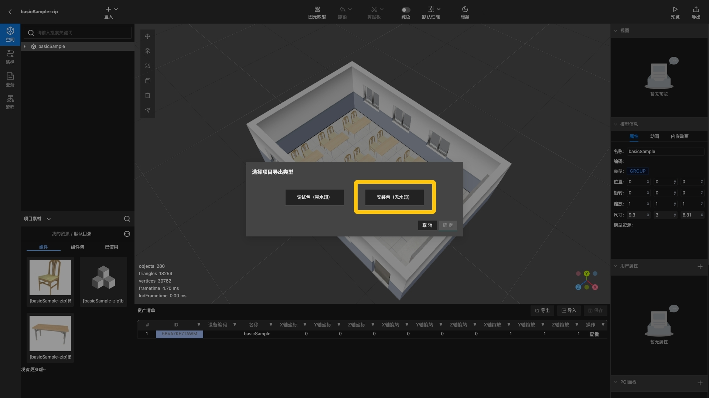
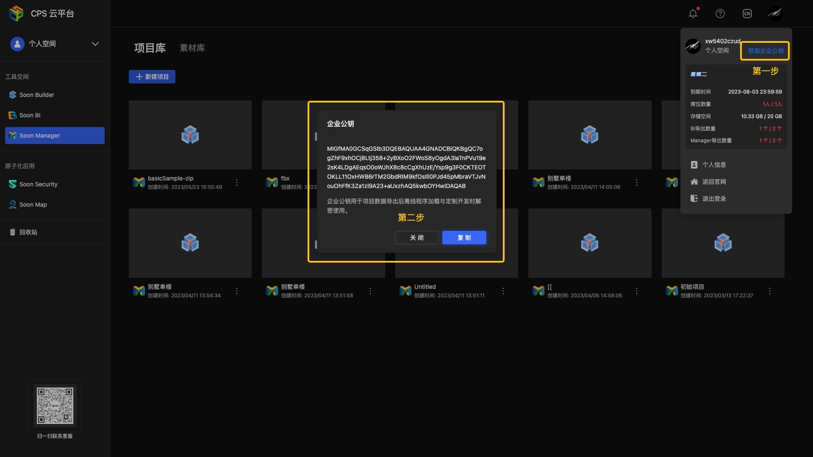

# plugin-cps-soonmanager


[CPS 平台](https://sooncps.xwbuilders.com/workspace/manager) 生产的场景加载及数据读取。

此插件是基于 [soonmanager2-sync](./soonmanager2-sync.html) 插件的扩展，并完全向下兼容。

## 样例

<Docs-Iframe src="plugin/cpsSoonmanager.html" />

## 安装

```bash
npm install @soonspacejs/plugin-cps-soonmanager
# or
yarn add @soonspacejs/plugin-cps-soonmanager
```

## 使用方法

```js {2,10-13}
import SoonSpace from 'soonspacejs';
import CpsSoonmanagerPlugin from '@soonspacejs/plugin-soonmanager2-sync';

const ssp = new SoonSpace({
  el: '#view',
  options: {},
  events: {},
});

const cpsSoonmanagerPlugin = ssp.registerPlugin(
  CpsSoonmanagerPlugin,
  'cpsSoonmanagerPlugin'
);
console.log(cpsSoonmanagerPlugin);
```

## 属性

### path

资源加载的基础路径

- **默认值:** `''`
- **类型:** `string`

### metaData

场景元数据

- **默认值:** `null`
- **类型:** `IMetadata | null`

#### 定义

```ts
interface IMetadata {
  platformVersion: number;
  version: number;
  name: string;
  projectId: string;
  sceneId: string;
  cover: string | null;
  flatModel: string;
  treeModel: string;
  resource: string;
  exportTime: number;
  environment?: string;
}
```

### treeData

场景树数据

- **默认值:** `null`
- **类型:** `ITreeData[] | null`

#### 定义

```ts
interface ITreeData {
  id: string;
  pid: string | null;
  name: string;
  renderType: 'GROUP' | '3D' | 'ROOM' | 'STUB';
  matrix: number[];
  path: string | null;
  children: ITreeData[];
}
```

### topologyData

拓扑路径数据

- **默认值:** `null`
- **类型:** [`TopologyInfo[]`](../api/topology.html#topologyinfo) | `null`

### propertiesData

自定义属性数据，根据 `modelId` 分组

- **默认值:** `null`
- **类型:** `TPropertiesMap | null`

#### 定义

```ts
interface IProperties {
  modelId: string;
  group: string;
  key: string;
  value: string | null;
  label: string | null;
}

type TPropertiesMap = Map<IProperties['modelId'], IProperties[]>;
```

### animationsData

补间动画数据，根据 `modelId` 分组

- **默认值:** `null`
- **类型:** `TAnimationsMap | null`

#### 定义

```ts
interface IKeyframe {
  id: string;
  uuid: string;
  x: number;
  y: number;
  z: number;
  scaleX: number;
  scaleY: number;
  scaleZ: number;
  rotationX: number;
  rotationY: number;
  rotationZ: number;
  easing: AnimationModeType;
  mode: string;
  delay: number;
  duration: number;
  repeat: number;
  yoyo: boolean;
}

/**
 * 动画
 */
interface IAnimations {
  id: string;
  uuid: string;
  modelId: string;
  name: string;
  keyframes: IKeyframe[];
}

type TAnimationsMap = Map<IAnimations['modelId'], IAnimations[]>;
```

### modelVisionsData

模型视角数据，根据 `nodeId` 分组

- **默认值:** `null`
- **类型:** `TModelVisionsMap | null`

#### 定义

```ts
interface IModelVisions {
  id: string;
  uuid: string;
  nodeId: string;
  name: string;
  code?: any;
  position: IVector3;
  rotation: IVector3;
  target: IVector3;
}

type TModelVisionsMap = Map<IModelVisions['nodeId'], IModelVisions>;
```

## 方法

### setKey

设置企业公钥

::: tip 提示
如下图，只有使用 **安装包** 需去除场景水印时才需要设置企业公钥。


获取企业公钥, 请联系 CPS 平台企业 **管理员** 按下图提示操作获取。


整体设计逻辑
   
| 资源包类型 | 是否需要设置企业公钥 | 是否携带水印 |
|:---:|:---:|:---:|
| 调试包 | 否 | 是 |
| 安装包 | 是 | 否 |
| 旧版资源包 | 否 | 否 |
:::

#### 定义

```ts
function setKey(key: string): void;
```

#### 用法

```js
cpsSoonmanagerPlugin.setKey('xxxxxxxxxxxxxxxx');
```

::: warning 注意
需要在调用 `loadScene` 之前调用 `setKey` 方法，否则安装包将无法正常加载
:::


### setPath

设置加载资源的基础路径

#### 定义

```ts
function setPath(path: string): void;
```

#### 用法

```js
cpsSoonmanagerPlugin.setPath('./models');
// or
cpsSoonmanagerPlugin.setPath('http://xxx.com/models');
```

::: warning 注意
插件的其他方法依赖于 `path`，需要先设置才能使用
:::

### presetEffects

设置预设效果

#### 定义

```ts
interface IPresetEffectsOptions {
  hdr?: boolean;
  ssao?: boolean;
  directionalLightShadow?: boolean | { angle?: number };
}

function presetEffects(options?: IPresetEffectsOptions): Promise<void>;
```

#### 用法

```js
await cpsSoonmanagerPlugin.loadScene();
await cpsSoonmanagerPlugin.presetEffects({
  hdr: true,
  ssao: true,
  directionalLightShadow: true,
});
```

#### 参数

##### options

- **描述:** 场景加载选项
- **必填:** <Base-RequireIcon :isRequire="false"/>
- **类型:** `IPresetEffectsOptions`

##### IPresetEffectsOptions

<Docs-Table
    :data="[
      { prop: 'hdr', desc: '使用资源包中预设的 hdr 环境', type: 'boolean', require: false, default: 'true' },
      { prop: 'ssao', desc: '开启 SSAO  效果', type: 'boolean', require: false, default: 'true' },
      { prop: 'directionalLightShadow', desc: '开启平行光阴影', type: 'boolean', require: false, default: 'true' },
    ]"
/>

_各参数对应的方法_
| 参数 | 对应的内部方法 |
| :--------------------: | :----------------------------------------------------: |
| hdr | [setEnvironment](../api/sceneTool.html#setenvironment) |
| ssao | [setSSAO](../api/sceneTool.html#setssao) |
| directionalLightShadow | [createDirectionalLight](../api/light.html#createdirectionallight) |

::: warning 注意
presetEffects 需要等待场景加载完调用
:::

### loadScene

加载场景对象

#### 定义

```ts
interface ILoadSceneOptions {
  /**
   * 同步自定义属性
   */
  syncProperties?: boolean;
  /**
   * 同步模型视角数据
   */
  syncModelVisions?: boolean;
  /**
   * 计算 bounds tree
   */
  needsModelsBoundsTree?: boolean;
  /**
   * 应用预设效果
   */
  applyPresetEffects?: boolean;
}

function loadScene(options?: ILoadSceneOptions): Promise<void>;
```

#### 用法

```js
cpsSoonmanagerPlugin.loadScene().then(() => {
  console.log('场景对象加载完成');
});
```

::: tip 提示
如果你需要使用 Worker 计算 BVH，可以关闭默认行为

```js
cpsSoonmanagerPlugin.loadScene({ needsModelsBoundsTree: false }).then(() => {
  ssp.computeModelsBoundsTree({
    type: 'worker',
    workerCreator,
  });
});
```

具体请查看 [computeModelsBoundsTree](../api/model.html#computemodelsboundstree)

:::

#### 参数

##### options

- **描述:** 场景加载选项
- **必填:** <Base-RequireIcon :isRequire="false"/>
- **类型:** `ILoadSceneOptions`

##### ILoadSceneOptions

<Docs-Table
    :data="[
      { prop: 'syncProperties', desc: '是否同步自定义属性', type: 'boolean', require: false, default: 'true' },
      { prop: 'syncModelVisions', desc: '是否同步节点视角数据', type: 'boolean', require: false, default: 'true' },
      { prop: 'needsModelsBoundsTree', desc: '场景加载完成后调用 ssp.computeModelsBoundsTree 方法', type: 'boolean', require: false, default: 'true' },
      { prop: 'applyPresetEffects', desc: '默认调用 presetEffects 方法', type: 'boolean', require: false, default: 'false' },
    ]"
/>

::: tip 提示
自定义属性存储在对象的 `userData.properties` 属性上
:::

### getTopologies

获取拓扑路径数据

#### 定义

```ts
function getTopologies(): Promise<TopologyInfo[]>;
```

#### 用法

```js
cpsSoonmanagerPlugin.getTopologies().then((topologies) => {
  const [t1] = topologies;

  /**
   * 使用获取到的数据直接创建拓扑路径
   */
  ssp.createTopology(t1);
});
```

### playAnimationById

根据对象 `id` 播放补间动画

#### 定义

```ts
type TAnimationsTweenProps = Pick<
  IKeyframe,
  | 'x'
  | 'y'
  | 'z'
  | 'rotationX'
  | 'rotationY'
  | 'rotationZ'
  | 'scaleX'
  | 'scaleY'
  | 'scaleZ'
>;

interface IPlayAnimationByIdOptions {
  onUpdate?: (
    source: TAnimationsTweenProps,
    tween: Tween<TAnimationsTweenProps>
  ) => void;
  onStart?: (tween: Tween<TAnimationsTweenProps>) => void;
}

function playAnimationById(
  id: string,
  animationIndex?: number,
  options?: IPlayAnimationByIdOptions
): Promise<void>;
```

#### 用法

```js
soonmanager2SyncPlugin.playAnimationById('4H6T1H53CSFW', 0, {
  onUpdate: (source, tween) => {},
  onStart: (tween) => {
    /**
     * 包含多个帧动画时，每个动画帧开始时 onStart 都会执行
     */
    console.log(tween);
  },
});
```

#### 参数

##### id

- **描述:** 要播放动画的对象 `id`
- **必填:** <Base-RequireIcon :isRequire="true"/>
- **类型:** `string`

##### animationIndex

- **描述:** 该动画所在数据列表中的下标
- **必填:** <Base-RequireIcon :isRequire="false"/>
- **默认值:** `0`
- **类型:** `number`

##### options

- **描述:** 动画播放选项
- **必填:** <Base-RequireIcon :isRequire="false"/>
- **类型:** `IPlayAnimationByIdOptions`

##### IPlayAnimationByIdOptions

<Docs-Table
    :data="[
      { prop: 'onUpdate', desc: '动画更新回调', type: 'IPlayAnimationByIdOptions[\'onUpdate\']', require: false, default: '' },
      { prop: 'onStart', desc: '动画开始回调', type: 'IPlayAnimationByIdOptions[\'onStart\']', require: false, default: '' },
    ]"
/>

::: tip 提示
动画播放时，可以是多个 `animation` 的组合

所以每次执行新的 `animation` 方法时都会执行 `onStart` 回调并且返回新的 `tween` 实例
:::

### fetchMetaData

根据当前 `path` 获取场景元数据

#### 定义

```ts
function fetchMetaData(): Promise<IMetadata>;
```

#### 用法

```ts
soonmanager2SyncPlugin.fetchMetaData().then((metaData) => {
  console.log(fetchMetaData);
});
```

### fetchTreeData

根据当前 `path` 获取场景树数据

#### 定义

```ts
function fetchTreeData(): Promise<ITreeData[]>;
```

#### 用法

```ts
soonmanager2SyncPlugin.fetchTreeData().then((treeData) => {
  console.log(treeData);
});
```

::: tip 提示
调用 `loadScene` 时，内部会使用此方法获取场景树数据
:::

### fetchPropertiesData

根据当前 `path` 获取自定义属性数据

#### 定义

```ts
function fetchPropertiesData(): Promise<TPropertiesMap>;
```

#### 用法

```ts
soonmanager2SyncPlugin.fetchPropertiesData().then((propertiesData) => {
  console.log(propertiesData);
});
```

### fetchAnimationsData

根据当前 `path` 获取补间动画数据

#### 定义

```ts
function fetchAnimationsData(): Promise<TAnimationsMap>;
```

#### 用法

```ts
soonmanager2SyncPlugin.fetchAnimationsData().then((animationsData) => {
  console.log(animationsData);
});
```

### fetchModelVisions

根据当前 `path` 获取模型视角数据

#### 定义

```ts
function fetchModelVisions(): Promise<TModelVisionsMap>;
```

#### 用法

```ts
soonmanager2SyncPlugin.fetchModelVisions().then((modelVisions) => {
  console.log(modelVisions);
});
```
