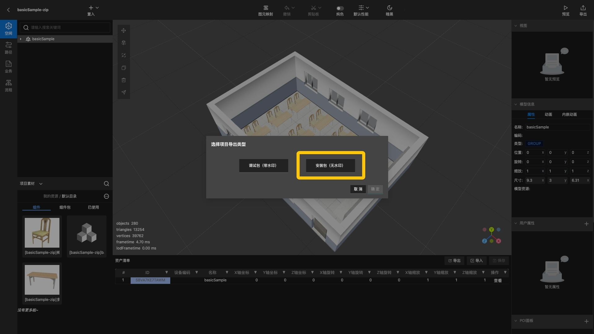
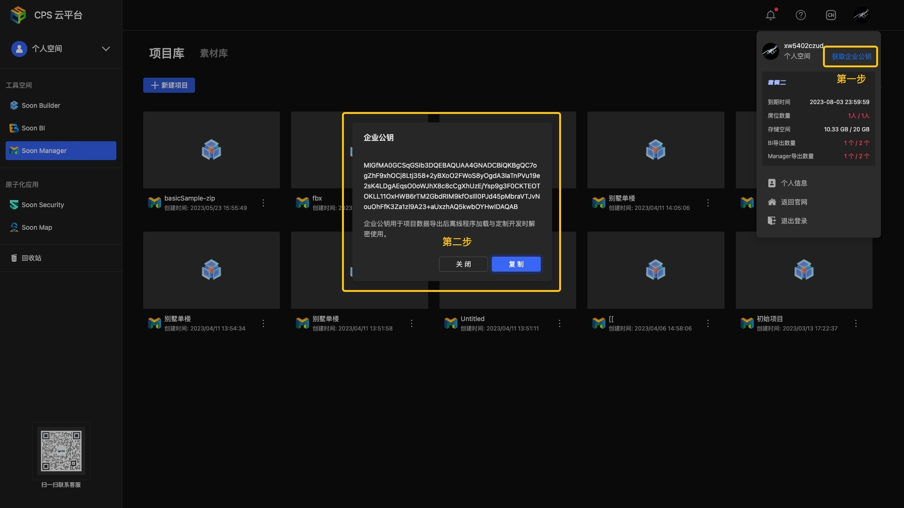

# plugin-cps-soonmanager


[CPS 平台](https://sooncps.xwbuilders.com/workspace/manager) 生产的场景加载及数据读取。

此插件是基于 [soonmanager2-sync](./soonmanager2-sync) 插件的扩展，并完全向下兼容。

## 样例

<Docs-Iframe src="plugin/cpsSoonmanager.html" />

## 安装

```bash
npm install @soonspacejs/plugin-cps-soonmanager
# or
yarn add @soonspacejs/plugin-cps-soonmanager
```

## 使用方法

```js {2,10-14}
import SoonSpace from 'soonspacejs';
import CpsSoonmanagerPlugin from '@soonspacejs/plugin-cps-soonmanager';

const ssp = new SoonSpace({
  el: '#view',
  options: {},
  events: {},
});

// 如需加载多个场景请注册多个插件
const cpsSoonmanagerPlugin = ssp.registerPlugin(CpsSoonmanagerPlugin, 'cpsSoonmanagerPlugin');
cpsSoonmanagerPlugin.setPath('xxx');
await cpsSoonmanagerPlugin.loadScene();
```

## 属性

### path

资源加载的基础路径

- **默认值:** `''`
- **类型:** `string`

### effectPlugin

特效插件实例

- **默认值:** `null`
- **类型:** `EffectPlugin | null`

```js
const effectPlugin = ssp.registerPlugin(EffectPlugin, 'effectPlugin');

cpsSoonmanagerPlugin.effectPlugin = effectPlugin;
cpsSoonmanagerPlugin.loadScene();
```

::: tip 提示
当 `renderType` 为 `WATER_SURFACE` 时，需要使用[特效插件](./effect)
:::

### sceneGroup

<Base-Tag title="readonly" />

场景 Group 对象

场景树的顶层对象会作为 sceneGroup 的 `children`。

```js
// Group 的默认 id 是 `path` 属性，可以通过 `getObjectById` 获取
const sceneGroup = ssp.getObjectById(path);
// 设置该场景的整体偏移
sceneGroup.position.set(10, 0, 0);
```

- **默认值:** `null`
- **类型:** `Group | null`

### metaData

<Base-Tag title="readonly" />

场景元数据

调用 [fetchMetaData](#fetchmetadata) 方法时会设置此属性

- **默认值:** `null`
- **类型:** `IMetadata | null`

#### 定义

```ts
interface IMetadata {
  platformVersion: number;
  version: number;
  name: string;
  projectId: string;
  sceneId: string;
  cover: string | null;
  flatModel: string;
  treeModel: string;
  resource: string;
  exportTime: number;
  environment?: string;
}
```

<!-- ### treeData

<Base-Tag title="readonly" />

场景树数据

调用 [loadScene](#loadscene) 方法时会设置此属性

- **默认值:** `null`
- **类型:** `ITreeData[] | null`

#### 定义

```ts
interface ITreeData {
  id: string;
  pid: string | null;
  sid: string;
  name: string;
  renderType: 'GROUP' | '3D' | 'ROOM' | 'STUB' | 'POLYGON' | 'CIRCLE' | 'WATER_SURFACE' | 'DECAL';
  deviceCode: string | null;
  matrix: number[];
  path: string | null;
  familyId: string | null;
  children: ITreeData[];
  visible: boolean;
  shape?: {
    height: number;
    radius: number;
    points?: IVector3[];
  };
  boundingBox?: number[];
  extra?: {
    [key: string]: any;
  };
}
```

|    字段     |                  释义                  |
| :---------: | :------------------------------------: |
|     id      | 场景内对象的绑定 `id`，是以前的 `uuid` |
|     pid     |               父级的 id                |
|    name     |   对象的名称，作为对象的 `name` 属性   |
|     sid     |        数据库生成的唯一随机 id         |
| renderType  |             对象的渲染类型             |
| deviceCode  |                设备编码                |
|   matrix    |           对象的局部矩阵信息           |
|    path     |                资源路径                |
|  familyId   |          模型资源的组件 `id`           |
|  children   |              子对象的数组              |
|   visible   |           初始化对象是否可见           |
|    shape    |           多边形、水面等信息           |
| boundingBox |         房间等对象的包围盒数据         |
|    extra    |              一些额外信息              |

::: tip 检索对象的几种方式
除了 `children` 其他字段都会存在每个对象的 `userData` 上

```js
// 使用 `id` 获取
const model = ssp.getObjectById('xxx');

// 使用 `name` 获取
const [model] = ssp.getObjectByName('xxx');

// 假设定义了一个 deviceCode 为 kx-1
const [deviceModel] = ssp.getObjectByUserDataProperty('deviceCode', 'kx-1');
```

:::

::: warning 注意
`2024-08-09` 之后导出的版本，已经将现在的 `id` 作为之前的 `uuid`。

如果使用旧版资源包或者新版资源包使用 `id`，使用 `loadScene` 方法时传入 `{ asId: 'id' }`。
::: -->

### poiData

<Base-Tag title="readonly" />

场景内配置 Poi 数据, 该数据在加载场景（loadScene）时自动获取。

- **默认值:** `null`
- **类型:** `IPoiData[] | null`

#### 定义

```ts
export enum PoiContentTypeEnum {
  PANEL = 'PANEL',
  VIDEO = 'VIDEO',
  VIDEO_STREAM = 'VIDEO_STREAM',
}

interface IPoiData {
  projectId: string;
  sceneId: string;
  nodeId: string;
  poiId: string;
  name: string;
  width: number;
  height: number;
  x: number;
  y: number;
  z: number;
  rotationX: number;
  rotationY: number;
  rotationZ: number;
  scale: number;
  dimensional: PoiNodeType;
  content: string;
  media: Record<string, string> | null;
  contentType: PoiContentTypeEnum;
  display: boolean;
  style: string;
}
```

### topologyData

<Base-Tag title="readonly" />

拓扑路径数据

调用 [getTopologies](#gettopologies) 方法时会设置此属性

- **默认值:** `null`
- **类型:** [`TopologyInfo[]`](../api/topology#topologyinfo) | `null`

### propertiesData

<Base-Tag title="readonly" />

自定义属性数据，根据 `modelId` 分组

调用 [fetchPropertiesData](#fetchpropertiesdata) 方法时会设置此属性

- **默认值:** `null`
- **类型:** `TPropertiesMap | null`

#### 定义

```ts
interface IProperties {
  modelId: string;
  group: string;
  key: string;
  value: string | null;
  label: string | null;
}

type TPropertiesMap = Map<IProperties['modelId'], IProperties[]>;
```

### animationsData

<Base-Tag title="readonly" />

补间动画数据，根据 `modelId` 分组

调用 [fetchAnimationsData](#fetchanimationsdata) 方法时会设置此属性

- **默认值:** `null`
- **类型:** `TAnimationsMap | null`

#### 定义

```ts
interface IKeyframe {
  id: string;
  uuid: string;
  x: number;
  y: number;
  z: number;
  scaleX: number;
  scaleY: number;
  scaleZ: number;
  rotationX: number;
  rotationY: number;
  rotationZ: number;
  easing: AnimationModeType;
  mode: string;
  delay: number;
  duration: number;
  repeat: number;
  yoyo: boolean;
}

/**
 * 动画
 */
interface IAnimations {
  id: string;
  uuid: string;
  modelId: string;
  name: string;
  keyframes: IKeyframe[];
}

type TAnimationsMap = Map<IAnimations['modelId'], IAnimations[]>;
```

### modelVisionsData

<Base-Tag title="readonly" />

模型视角数据，根据 `nodeId` 分组

调用 [fetchModelVisionsData](#fetchmodelvisionsdata) 方法时会设置此属性

- **默认值:** `null`
- **类型:** `TModelVisionsMap | null`

#### 定义

```ts
interface IModelVisions {
  id: string;
  uuid: string;
  nodeId: string;
  name: string;
  camera: 'O' | 'P';
  position: IVector3;
  rotation: IVector3;
  target: IVector3;
  zoom: number;
  primary: boolean;
}

type TModelVisionsMap = Map<IModelVisions['nodeId'], IModelVisions[]>;
```

::: tip 提示
Map 的 key 为 "" 时，表示场景视角数据
:::

### spacesData

<Base-Tag title="readonly" />

模型视角数据，根据 `sid` 分组

调用 [fetchSpacesData](#fetchspacesdata) 方法时会设置此属性

- **默认值:** `null`
- **类型:** `TSpacesMap | null`

#### 定义

```ts
interface ISpaces {
  id: string;
  sid: string;
  name: string;
  type: string;
  matrix: number[];
  visible: boolean;
  // treeData 中的 id 列表
  assets: string[] | null;
  children: ISpaces[] | null;
}

export type TSpacesMap = Map<ISpaces['sid'], ISpaces>;
```

### soonflow

<Base-Tag title="readonly" />

流程执行引擎实例

- **类型:** [SoonFlow](https://www.npmjs.com/package/@soonflow/core)

### flowData

<Base-Tag title="readonly" />

场景中配置好的流程数据，数据可提供给 [runFlowById](#runflowbyid) 使用。

- **默认值:** `null`
- **类型:** `any[] | null`

## 方法

### setKey

设置企业公钥

::: tip 提示
如下图，只有使用 **安装包** 需去除场景水印时才需要设置企业公钥。


获取企业公钥, 请联系 CPS 平台企业 **管理员** 按下图提示操作获取。


整体设计逻辑

| 资源包类型 | 是否需要设置企业公钥 | 是否携带水印 |
| :--------: | :------------------: | :----------: |
|   调试包   |          否          |      是      |
|   安装包   |          是          |      否      |
| 旧版资源包 |          否          |      否      |

:::

#### 定义

```ts
function setKey(key: string): void;
```

#### 用法

```js
cpsSoonmanagerPlugin.setKey('xxxxxxxxxxxxxxxx');
```

::: warning 注意
需要在调用 `loadScene` 之前调用 `setKey` 方法，否则安装包将无法正常加载
:::

### setPath

设置加载资源的基础路径

#### 定义

```ts
function setPath(path: string): void;
```

#### 用法

```js
cpsSoonmanagerPlugin.setPath('./models');
// or
cpsSoonmanagerPlugin.setPath('http://xxx.com/models');
```

::: warning 注意
插件的其他方法依赖于 `path`，需要先设置才能使用
:::

### loadScene

加载场景对象

配合 `loadTargetId` 或 `loadLevel` 使用可以重复调用

#### 定义

```ts
export enum LoadSceneAlgorithm {
  BFS = 'BFS', // 广度优先
  DFS = 'DFS', // 深度优先
}
```

```ts
interface ILoadSceneOptions {
  /**
   * 平台解密公钥
   */
  key?: string;
  /**
   * 资源包路径
   */
  path?: string;
  /**
   * 保留源 Model API，并通过内部代理自动合批
   */
  autoInstancing?: boolean | AutoInstancingOptions;
  /**
   * 同步自定义属性
   */
  syncProperties?: boolean;
  /**
   * 同步模型视角数据
   */
  syncModelVisions?: boolean;
  /**
   * 计算 bounds tree
   */
  needsModelsBoundsTree?: boolean;
  /**
   * 应用预设效果
   */
  applyPresetEffects?: boolean;
  /**
   * 同步场景算法 BFS | DFS
   */
  loadSceneAlgorithm?: LoadSceneAlgorithm;
  /**
   * 目标节点 id（DFS时有效）
   */
  loadTargetId?: ITreeData['id'];
  /**
   * 需要加载的层级（DFS时有效）
   */
  loadLevel?: number;
  /**
   * v2.10.x
   * 需要隐藏的对象 id
   */
  hiddenObjects?: Set<string>;
  /**
   * 加载 poi
   */
  loadPoi?: boolean;
  /**
   * 通过数据源刷新 poi
   */
  refreshPoiByDataSource?: boolean;
  /**
   * 加载流程数据
   */
  loadFlowData?: boolean;
  /**
   * 场景 group 信息
   */
  sceneGroupInfo?: Partial<BaseObjectInfo>;
  /**
   * 对象 id 前缀
   */
  objectPrefixId?: string;
  /**
   * 作为对象的 id
   */
  asId?: 'id' | 'sid';
}

function loadScene(options?: ILoadSceneOptions): Promise<void>;
```

#### 用法

```js
// 进度事件
cpsSoonmanagerPlugin.addEventListener('progressing', ({ progress }) => {
  console.log((progress.loaded / progress.total) * 100 + '% loaded');
});

cpsSoonmanagerPlugin
  .loadScene()
  .then(() => {
    console.log('场景对象加载完成');
  })
  .catch((err) => {
    // key 验证失败时会触发此错误
    console.error(err);
  });
```

::: tip 提示
某些模型文件可能应用了 [DRACO](https://google.github.io/draco/) 压缩，建议调用 loadScene 方法之前调用 [setModelDracoDecoderPath](../api/model.md#setmodeldracodecoderpath) 方法设置 DRACO 解压路径
:::

::: tip 提示
如果你需要使用 Worker 计算 BVH，可以关闭默认行为

```js
await cpsSoonmanagerPlugin.loadScene({ needsModelsBoundsTree: false });

await ssp.computeModelsBoundsTree({
  type: 'worker',
  workerCreator,
});
```

具体请查看 [computeModelsBoundsTree](../api/model#computemodelsboundstree)

默认的 `needsModelsBoundsTree: true` 会在场景对象加载完成后启动分片计算，但 `loadScene()` 不等待 BVH 全部完成。如果后续逻辑依赖 BVH 已可用，请关闭默认行为并像上例一样手动 `await ssp.computeModelsBoundsTree()`。

:::

::: tip 提示

初始化加载大场景时，可以通过 `loadSceneAlgorithm` 参数设置加载场景算法为`BFS`，可以提升部分加载时间。

```ts
import { LoadSceneAlgorithm } from '@soonspacejs/plugin-cps-soonmanager';

cpsSoonmanagerPlugin
  .loadScene({
    loadSceneAlgorithm: LoadSceneAlgorithm.BFS,
  })
  .then(() => {
    ssp.flyMainViewpoint();

    console.log('场景对象加载完成');
  });
```

:::

#### 参数

##### options

- **描述:** 场景加载选项
- **必填:** <Base-RequireIcon :isRequire="false"/>
- **类型:** `ILoadSceneOptions`

##### ILoadSceneOptions

<Docs-Table
    :data="[
      { prop: 'key', desc: '等价于 setKey 方法', type: 'string', require: false, default: '' },
      { prop: 'path', desc: '等价于 setPath 方法', type: 'string', require: false, default: '' },
      { prop: 'autoInstancing', desc: '加载完成后启用场景自动合批；传对象时作为 AutoInstancingOptions', type: 'boolean | AutoInstancingOptions', require: false, default: 'undefined' },
      { prop: 'syncProperties', desc: '是否同步自定义属性，开启时自动调用 fetchPropertiesData 方法', type: 'boolean', require: false, default: 'true' },
      { prop: 'syncModelVisions', desc: '是否同步节点视角数据，开启时自动调用 fetchModelVisionsData 方法', type: 'boolean', require: false, default: 'true' },
      { prop: 'needsModelsBoundsTree', desc: '场景加载完成后在后台调用 ssp.computeModelsBoundsTree；loadScene 不等待 BVH 全部完成', type: 'boolean', require: false, default: 'true' },
      { prop: 'applyPresetEffects', desc: '默认调用 presetEffects 方法', type: 'boolean', require: false, default: 'true' },
      { prop: 'loadSceneAlgorithm', desc: '加载场景使用的算法', type: 'LoadSceneAlgorithm', require: false, default: 'LoadSceneAlgorithm.DFS' },
      { prop: 'loadTargetId', desc: '加载的目标树节点id', type: 'string', require: false, default: '' },
      { prop: 'loadLevel', desc: '加载的树层级。如果设置了loadTargetId，则以此为起始层。从1开始计算', type: 'number', require: false, default: 'Infinity' },
      { prop: 'hiddenObjects', desc: '初始化隐藏的对象 id 集合', type: 'Set&lt;string&gt;', require: false, default: '' },
      { prop: 'loadPoi', desc: '默认执行 loadPoi 方法', type: 'boolean', require: false, default: 'false' },
      { prop: 'refreshPoiByDataSource', desc: '默认执行 refreshPoiByDataSource 方法', type: 'boolean', require: false, default: 'false' },
      { prop: 'loadFlowData', desc: '默认执行 loadFlowData 方法', type: 'boolean', require: false, default: 'false' },
      { prop: 'sceneGroupInfo', desc: '场景 group 信息', type: 'Partial<BaseObjectInfo>', require: false, default: '{id: [this.path]}' },
      { prop: 'objectPrefixId', desc: '场景对象的id前缀', type: 'string', require: false, default: '' },
      { prop: 'asId', desc: '作为对象 id 的字段', type: 'id | sid', require: false, default: 'sid' },
    ]"
/>

::: tip 提示
自定义属性存储在对象的 `userData.properties` 属性上
:::

::: tip 大场景自动合批
`autoInstancing` 省略时不会改变当前状态；传 `true` 使用默认参数；传配置对象时启用并应用该参数；传 `false` 关闭当前 CPS 场景的自动合批。

```js
await cpsSoonmanagerPlugin.loadScene({
  autoInstancing: {
    minInstances: 2,
    maxInstancesPerBatch: 512,
    dynamicPromotionFrames: 2,
    transparentSinglePass: false,
    skipEmptyTextureUploads: false,
  },
});
```

`loadSceneAndSemantic` 和 `loadSceneAndSemanticInWorker` 使用同一个 `ILoadSceneOptions`，也支持该配置。完整参数和合批策略见 [性能：setAutoInstancing](../api/performance#setautoinstancing)。

如果初始化期间不需要渐进显示场景，可以暂停渲染，把加载过程中的对象变更合并为一次恢复渲染：

```js
await ssp.viewport.setPauseRender(true);

try {
  await cpsSoonmanagerPlugin.loadSceneAndSemantic({
    autoInstancing: true,
  });
} finally {
  await ssp.viewport.setPauseRender(false);
}
```
:::

###### 分层加载示例

<Docs-Iframe src="plugin/cpsSoonmanagerLevel.html" />

::: warning 警告
由于场景模型是嵌套的树结构，内部对象的矩阵变换依赖父级，如果先加载内部，可能会出现位置、旋转、缩放的错乱

建议 `loadTargetId` 设置为上层节点的 id
:::

### setAutoInstancing

切换当前 CPS 场景根节点的自动合批。原始 `Model` 和内部 Mesh 会继续保留在场景树中，对象查询、业务 ID、缓存、显隐、拾取和事件 API 不需要改写。

#### 定义

```ts
setAutoInstancing(
  enabled?: boolean,
  options?: AutoInstancingOptions
): void;
```

#### 用法

```js
cpsSoonmanagerPlugin.setAutoInstancing(true, {
  minInstances: 2,
  maxInstancesPerBatch: 512,
  dynamicPromotionFrames: 2,
});

// 关闭并移除该 CPS 场景的内部代理
cpsSoonmanagerPlugin.setAutoInstancing(false);
```

在场景根节点创建前调用该方法不会产生代理。需要随加载启用时，应优先使用 [loadScene](#loadscene) 的 `autoInstancing` 参数。

#### 参数

##### enabled

- **描述:** 是否启用自动合批
- **必填:** <Base-RequireIcon :isRequire="false"/>
- **类型:** `boolean`
- **默认值:** `true`

##### options

- **描述:** 自动合批配置
- **必填:** <Base-RequireIcon :isRequire="false"/>
- **类型:** [`AutoInstancingOptions`](../api/performance#autoinstancingoptions)
- **默认值:** `{}`

### getAutoInstancingStats

获取当前 CPS 场景的合批统计。该方法用于判断代理数量和兼容回退情况，不应使用页面显示的原始 Mesh 数量判断合批是否生效。

#### 定义

```ts
getAutoInstancingStats():
  | AutoInstancingStats
  | AutoInstancingStats[]
  | null;
```

场景根节点尚未创建时返回 `null`。

#### 用法

```js
const stats = cpsSoonmanagerPlugin.getAutoInstancingStats();
const list = Array.isArray(stats) ? stats : stats ? [stats] : [];

const proxyRenderables = list.reduce(
  (total, item) =>
    total +
    item.instancedBatches +
    item.mergedBatches +
    item.batchedBatches +
    item.passthroughObjects,
  0
);

console.table({
  sourceRenderables: list.reduce(
    (total, item) => total + item.sourceRenderables,
    0
  ),
  proxyRenderables,
  drawCalls: ssp.viewport.renderer.info.render.calls,
});
```

::: tip 性能验证
首次代理渲染可能包含 geometry 上传和 shader 编译。先预热若干帧，再在相同相机、分辨率和后处理配置下比较关闭/开启时的 draw call、帧耗时 p50 和 p95。详细方法见 [如何判断优化是否生效](../api/performance#如何判断优化是否生效)。
:::

::: warning 透明材质
`transparentSinglePass` 是减少双面透明 draw call 的可选视觉权衡。如果玻璃、水面等模型的前后表面混合发生变化，请关闭该选项。

CPS 语义辅助 Mesh 会按兼容材质组透明合批，以减少大场景 draw call；不同材质组之间不保证逐对象深度交错。如果业务依赖半透明语义对象之间的精确混合顺序，请对该场景调用 `cpsSoonmanagerPlugin.setAutoInstancing(false)`。
:::

### presetEffects

设置预设效果，参数来源由平台渲染后导出。

#### 定义

```ts
interface IPresetEffectsOptions {
  hdr?: boolean;
  ssao?: boolean;
  directionalLightShadow?: boolean | { angle?: number };
  toneMappping?: boolean;
}

function presetEffects(options?: IPresetEffectsOptions): Promise<void>;
```

#### 用法

```js
await cpsSoonmanagerPlugin.loadScene({
  applyPresetEffects: false,
});
await cpsSoonmanagerPlugin.presetEffects({
  hdr: true,
  ssao: true,
  directionalLightShadow: true,
  toneMappping: true,
});
```

#### 参数

##### options

- **描述:** 效果参数
- **必填:** <Base-RequireIcon :isRequire="false"/>
- **类型:** `IPresetEffectsOptions`

##### IPresetEffectsOptions

<Docs-Table
    :data="[
      { prop: 'hdr', desc: '使用资源包中预设的 hdr 环境', type: 'boolean', require: false, default: 'true' },
      { prop: 'ssao', desc: '开启 SSAO  效果', type: 'boolean', require: false, default: 'true' },
      { prop: 'directionalLightShadow', desc: '开启平行光阴影', type: 'boolean', require: false, default: 'true' },
      { prop: 'toneMappping', desc: '设置 toneMappping', type: 'boolean', require: false, default: 'true' },
    ]"
/>

_各参数对应的方法_
| 参数 | 对应的内部方法 |
| :--------------------: | :----------------------------------------------------: |
| hdr | [setEnvironment](../api/sceneTool#setenvironment) |
| ssao | [setSSAO](../api/sceneTool#setssao) |
| directionalLightShadow | [createDirectionalLight](../api/light#createdirectionallight) |
| toneMappping | [setToneMapping](../api/sceneTool.html#settonemapping) |

::: warning 注意
presetEffects 需要等待场景加载完调用
:::

### getTopologies

获取拓扑路径数据

#### 定义

```ts
function getTopologies(): Promise<TopologyInfo[]>;
```

#### 用法

```js
const topologiesInfo = await cpsSoonmanagerPlugin.getTopologies();

/**
 * 每个数组元素对应一个拓扑路径
 * 使用获取到的数据直接创建拓扑路径
 */
ssp.createTopology(topologiesInfo[0]);
ssp.createTopology(topologiesInfo[1]);
ssp.createTopology(topologiesInfo[2]);
```

### sortTopologyNodes

对拓扑路径数据的 nodes 进行排序（只适用于线路）

#### 定义

```ts
function sortTopologyNodes(topologyInfo: TopologyInfo, startNodeId?: TopologyNodeInfo['id']): TopologyInfo | undefined;
```

#### 用法

```js
const [topologyInfo] = await cpsSoonmanagerPlugin.getTopologies();

/**
 * 没有 startNodeId 则默认第0个 node 为起始 node
 */
const sortedToplogyInfo = cpsSoonmanagerPlugin.sortTopologyNodes(topologyInfo);

ssp.createTopology({
  ...sortedToplogyInfo,
  imgUrl: 'xxx.png',
  animation: true,
});
```

::: tip 提示
在播放路径动画或使用[巡检插件](./patrol-controls)时会按照 nodes 数组的顺序执行

所以可能需要使用此方法对线路的 nodes 排序
:::

### playObjectAnimation

根据动画数据播放对象的补间动画

#### 定义

```ts
type TAnimationsTweenProps = Pick<
  IKeyframe,
  'x' | 'y' | 'z' | 'rotationX' | 'rotationY' | 'rotationZ' | 'scaleX' | 'scaleY' | 'scaleZ'
>;

interface IPlayAnimationByIdOptions {
  autoStopPrevious?: boolean;
  onUpdate?: (source: TAnimationsTweenProps, tween: Tween<TAnimationsTweenProps>) => void;
  onStart?: (tween: Tween<TAnimationsTweenProps>) => void;
}

function playObjectAnimation(
  object: BaseObject3D,
  animationIndex?: number,
  options?: IPlayAnimationByIdOptions
): Promise<boolean>;
```

#### 用法

```js
const object = ssp.getObjectByUserDataProperty('deviceCode', '111');
cpsSoonmanagerPlugin.playObjectAnimation(object, 0, {
  autoStopPrevious: true,
  onUpdate: (source, tween) => {},
  onStart: (tween) => {
    /**
     * 包含多个帧动画时，每个动画帧开始时 onStart 都会执行
     */
    console.log(tween);
  },
});
```

#### 参数

##### object

- **描述:** 要播放动画的对象
- **必填:** <Base-RequireIcon :isRequire="true"/>
- **类型:** `BaseObject3D`

##### animationIndex

- **描述:** 该动画所在数据列表中的下标
- **必填:** <Base-RequireIcon :isRequire="false"/>
- **默认值:** `0`
- **类型:** `number`

##### options

- **描述:** 动画播放选项
- **必填:** <Base-RequireIcon :isRequire="false"/>
- **类型:** `IPlayAnimationByIdOptions`

##### IPlayAnimationByIdOptions

<Docs-Table
    :data="[
      { prop: 'autoStopPrevious', desc: '是否自动停止之前的动画', type: 'boolean', require: false, default: 'true' },
      { prop: 'onUpdate', desc: '动画更新回调', type: 'IPlayAnimationByIdOptions[\'onUpdate\']', require: false, default: '' },
      { prop: 'onStart', desc: '动画开始回调', type: 'IPlayAnimationByIdOptions[\'onStart\']', require: false, default: '' },
    ]"
/>

::: tip 提示
动画播放时，可以是多个 `animation` 的组合

所以每次执行新的 `animation` 方法时都会执行 `onStart` 回调并且返回新的 `tween` 实例
:::

### stopObjectAnimation

停止由 [playObjectAnimation](#playobjectanimation) 方法触发的补间动画

#### 定义

```ts
function stopObjectAnimation(object: BaseObject3D): Promise<boolean>;
```

#### 用法

```js
cpsSoonmanagerPlugin.stopObjectAnimation(object);
```

### flyToSceneFromVisionsData

根据场景视角数据飞向

#### 定义

```ts
function flyToSceneFromVisionsData(index?: number): Promise<boolean>;
```

#### 用法

```js
cpsSoonmanagerPlugin.flyToSceneFromVisionsData(0);
```

#### 参数

##### index

- **描述:** 该视角所在数据列表中的下标
- **必填:** <Base-RequireIcon :isRequire="false"/>
- **类型:** `number`

### flyToMainSceneFromVisionsData

根据场景视角数据飞向主视角

#### 定义

```ts
function flyToMainSceneFromVisionsData(fallback?: boolean): Promise<boolean>;
```

#### 用法

```js
const success = await cpsSoonmanagerPlugin.flyToMainSceneFromVisionsData();
```

#### 参数

##### fallback

- **描述:** 没有主视角时，是否默认调用 [`flyMainViewpoint`](../api/camera#flymainviewpoint)。默认是 `true`
- **必填:** <Base-RequireIcon :isRequire="false"/>
- **类型:** `boolean`

### flyToObjectFromVisionsData

根据对象视角数据飞向

#### 定义

```ts
function flyToObjectFromVisionsData(object: BaseObject3D, index?: number): Promise<boolean>;
```

#### 用法

```js
const model = ssp.getObjectByUserDataProperty('device', 'xxx');

cpsSoonmanagerPlugin.flyToObjectFromVisionsData(model, 0);
```

#### 参数

##### object

- **描述:** 场景对象
- **必填:** <Base-RequireIcon :isRequire="true"/>
- **类型:** `BaseObject3D`

##### index

- **描述:** 该视角所在数据列表中的下标
- **必填:** <Base-RequireIcon :isRequire="false"/>
- **类型:** `number`

### flyToMainObjectFromVisionsData

根据对象视角数据飞向默认视角

#### 定义

```ts
function flyToMainObjectFromVisionsData(object: BaseObject3D, fallback?: boolean): Promise<boolean>;
```

#### 用法

```js
const model = ssp.getObjectByUserDataProperty('device', 'xxx');

const success = await cpsSoonmanagerPlugin.flyToMainObjectFromVisionsData(model);
```

#### 参数

##### object

- **描述:** 场景对象
- **必填:** <Base-RequireIcon :isRequire="true"/>
- **类型:** `BaseObject3D`

##### fallback

- **描述:** 没有默认视角时，是否默认调用 [`flyToObj`](../api/camera#flytoobj)。默认是 `true`
- **必填:** <Base-RequireIcon :isRequire="false"/>
- **类型:** `boolean`

### getSpaceAssets

获取空间下辖设备列表

#### 定义

```ts
function getSpaceAssets<T extends BaseObject3D = BaseObject3D>(space: BaseObject3D): Promise<T[]>;
```

#### 用法

```ts
const [spaceObject] = ssp.getObjectByUserDataProperty('space', 'xxx');
const spaceAssets = await cpsSoonmanagerPlugin.getSpaceAssets(spaceObject);
```

#### 参数

##### space

- **描述:** 空间对象
- **必填:** <Base-RequireIcon :isRequire="true"/>
- **类型:** `BaseObject3D`

### loadPoi

根据 poiData 渲染 Poi。

::: tip 使用提示
如果 `loadScene` 时参数 `loadPoi` 已设置开启将自动执行，无需手动调用。
:::

#### 定义

```ts
function loadPoi(refreshByDataSource: boolean): Promise<void>;
```

#### 用法

```ts
cpsSoonmanagerPlugin.loadPoi(true);
```

#### 参数

##### refreshByDataSource

- **描述:** 加载完调用 [refreshPoiByDataSource](#refreshbydatasource)
- **必填:** <Base-RequireIcon :isRequire="false"/>
- **类型:** `boolean`

### refreshPoiByDataSource

通过数据源刷新 Poi

::: tip 使用提示
如果 `loadScene` 时参数 `refreshPoiByDataSource` 或手动执行 `loadPoi` 时 `refreshPoiByDataSource` 已设置开启都将自动执行，无需手动调用。
:::

#### 定义

```ts
function refreshPoiByDataSource(): Promise<void>;
```

#### 用法

```ts
cpsSoonmanagerPlugin.loadPoi();
cpsSoonmanagerPlugin.refreshPoiByDataSource();
```

### loadFlowData

加载场景的流程数据

::: tip 使用提示
如果 `loadScene` 时参数 `loadFlowData` 已设置开启将自动执行，无需手动调用。
:::

#### 定义

```ts
function loadFlowData(): Promise<void>;
```

#### 用法

```ts
// 假设执行第一条流程
cpsSoonmanagerPlugin.loadFlowData().then(() => {
  console.log('流程数据加载完成');
});
```

### runFlowById

手动执行场景流程，流程 id 可在 [flowData](#flowdata) 中获取。

::: warning 使用提示
使用该方法时必须确保 `loadFlowData` 已执行完成，`loadFlowData` 可通过 `loadScene` 参数 `loadFlowData` 配置开启自动加载 或 手动调用 `loadFlowData` 方法。
:::

#### 定义

```ts
function runFlowById(id: string): Promise<void>;
```

#### 用法

```ts
// 假设执行第一条流程
cpsSoonmanagerPlugin.runFlowById(cpsSoonmanagerPlugin.flowData[0].id);
```

### fetchMetaData

根据当前 `path` 获取场景元数据

由 [loadScene](#loadscene) 方法调用

#### 定义

```ts
function fetchMetaData(): Promise<IMetadata>;
```

#### 用法

```ts
cpsSoonmanagerPlugin.fetchMetaData().then((metaData) => {
  console.log(fetchMetaData);
});
```

### fetchTreeData <Base-Deprecated />

根据当前 `path` 获取场景树数据

#### 定义

```ts
function fetchTreeData(): Promise<ITreeData[]>;
```

#### 用法

```ts
cpsSoonmanagerPlugin.fetchTreeData().then((treeData) => {
  console.log(treeData);
});
```

::: warning 注意
此方法已不适用于加密资源包
:::

### fetchPropertiesData

根据当前 `path` 获取自定义属性数据

由 [loadScene](#loadscene) 方法调用

#### 定义

```ts
function fetchPropertiesData(): Promise<TPropertiesMap>;
```

#### 用法

```ts
cpsSoonmanagerPlugin.fetchPropertiesData().then((propertiesData) => {
  console.log(propertiesData);
});
```

### fetchAnimationsData

根据当前 `path` 获取补间动画数据

由 [playAnimationById](#playanimationbyid) 方法调用

#### 定义

```ts
function fetchAnimationsData(): Promise<TAnimationsMap>;
```

#### 用法

```ts
cpsSoonmanagerPlugin.fetchAnimationsData().then((animationsData) => {
  console.log(animationsData);
});
```

### fetchModelVisionsData

根据当前 `path` 获取模型视角数据

由 [flyToSceneFromVisionsData](#flytoscenefromvisionsdata) 和 [flyToObjectFromVisionsData](#flytoobjectfromvisionsdata) 方法调用

#### 定义

```ts
function fetchModelVisionsData(): Promise<TModelVisionsMap>;
```

#### 用法

```ts
cpsSoonmanagerPlugin.fetchModelVisionsData().then((modelVisions) => {
  console.log(modelVisions);
});
```

### fetchSpacesData

根据当前 `path` 获取空间数据

由 [getSpaceAssets](#getspaceassets) 方法调用

#### 定义

```ts
function fetchSpacesData(): Promise<Map<string, ISpaces>>;
```

#### 用法

```ts
cpsSoonmanagerPlugin.fetchSpacesData().then((spacesData) => {
  console.log(spacesData);
});
```

## FDS 体数据

`CpsSoonmanagerPlugin` 内置 `FdsManager`，可以读取场景中的 `fds.json`，也可以直接传入 URL 或 FDS 数据项。

### loadFDS

```ts
loadFDS(
  input?: string | IFdsData | Array<string | IFdsData>,
  options?: {
    field?: 'temperature' | 'soot_density' | 'hrrpuv'
  }
): Promise<VolumePoints[]>
```

```ts
await cpsSoonmanagerPlugin.loadFDS(undefined, {
  field: 'temperature',
})
```

不传 `input` 时，插件会读取 `fetchFDSData()` 的可见数据源；没有有效数据源时回退到当前场景目录下的默认 FDS 数据文件。

### 播放控制

| API | 返回值 | 说明 |
| --- | --- | --- |
| `getFDSState()` | `IFdsManagerState` | 获取活动体、时间、帧和播放状态。 |
| `playFDS()` | `boolean` | 播放当前活动体。 |
| `pauseFDS()` | `boolean` | 暂停。 |
| `toggleFDSPlay()` | `boolean` | 切换播放状态。 |
| `setFDSTime(timeSec, options?)` | `Promise<VolumePoints \| null>` | 跳到指定秒数；`options.wait` 默认为 `true`。 |
| `clearFDS()` | `number` | 移除全部 FDS 体对象并返回数量。 |

更底层的 FDS 数据结构与事件见 [plugin-fds](./fds)。

## 补充数据读取 API

以下方法直接读取并返回对应场景资源。不同加载流程会按需要缓存其中一部分结果；不要假定直接调用每个 `fetch*` 都会更新同名属性。

| API | 返回值 |
| --- | --- |
| `fetchSemanticData()` | `Promise<SemanticObject>` |
| `fetchRoadsData()` | `Promise<IRoadsData>` |
| `fetchFlatData()` | `Promise<IFlatData[]>` |
| `fetchPoiData()` | `Promise<IPoiData[]>` |
| `fetchDataSourceData()` | `Promise<any>` |
| `fetchTopologyData()` | `Promise<ITopologyPath[]>` |
| `fetchFlowsData()` | `Promise<FlowType[]>` |
| `fetchGisData()` | `Promise<IGisData>` |
| `fetchGisPlotsData()` | `Promise<IGisPlot[]>` |
| `fetchFDSData()` | `Promise<IFdsData[]>` |

`loadTopologies()` 会读取 `fetchTopologyData()` 并为每条数据调用 `ssp.createTopology()`；`presetGis()` 会按元数据初始化地形、倾斜摄影、影像和 GeoJSON。

::: warning presetGis 生命周期
不要把 `presetGis()` 当作可重复刷新的 API。部分地形分支会创建新的 renderer 并覆盖当前引用，重复调用前不会先释放旧实例。通常应由 `loadScene*` 流程调用一次。
:::

## Work ID 映射

### applyWorkIdMap

```ts
applyWorkIdMap(
  workIdMap?: IWorkIdMap | null
): IApplyWorkIdMapResult
```

```ts
const result = cpsSoonmanagerPlugin.applyWorkIdMap({
  'scene-object-id': { work_id: 'business-object-id' },
})
```

映射会把 `work_id` 写入对象 `userData`、`extraIds` 和 SoonSpace 对象缓存。尚未加载的目标会保留为 pending，并在对象创建后继续应用。

```ts
interface IApplyWorkIdMapResult {
  received: number
  accepted: number
  applied: number
  pending: number
  invalid: number
  duplicates: number
}
```

## 其他公开方法

| API | 说明 |
| --- | --- |
| `refreshByUserData()` | 注册属性变化监听并同步 POI。应只调用一次，避免重复监听。 |
| `runWithCode(fn)` | 通过 SoonSpace `utils.runWithCode` 执行函数。 |
| `getTreeNodeById(id, treeData, options)` | 递归查询树节点。第三个参数使用内部加载选项，业务通常无需直接调用。 |
| `dispose()` | 中止语义加载，并释放 FDS、道路、场景 Group、大气和当前地形/tiles。 |

::: warning refreshByUserData 生命周期
`refreshByUserData()` 注册的 `propertiesChanged` 监听不会由 `dispose()` 移除，`dispose()` 也不会清空 `objectsAnimations`。只在插件与 SoonSpace 实例同生命周期时启用该监听；销毁前应先停止业务持有的动画。
:::
