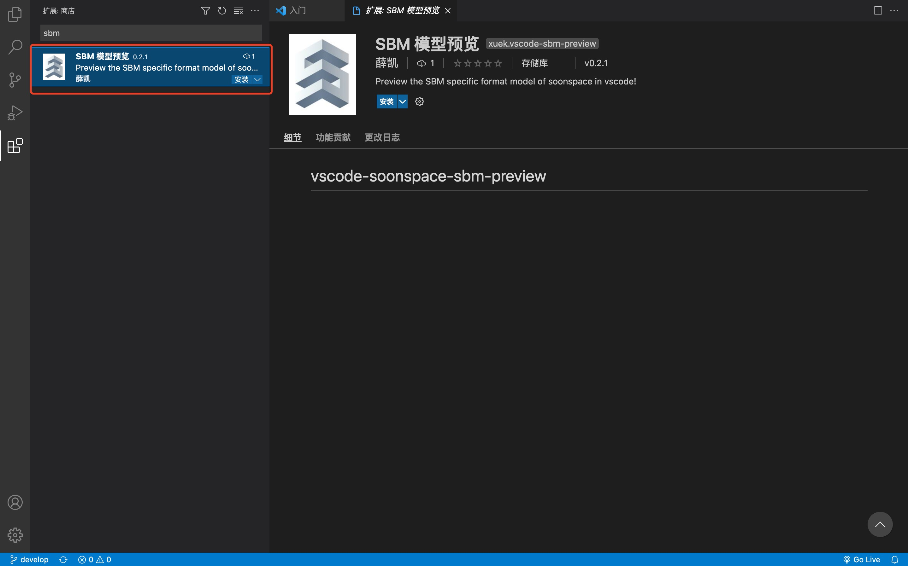
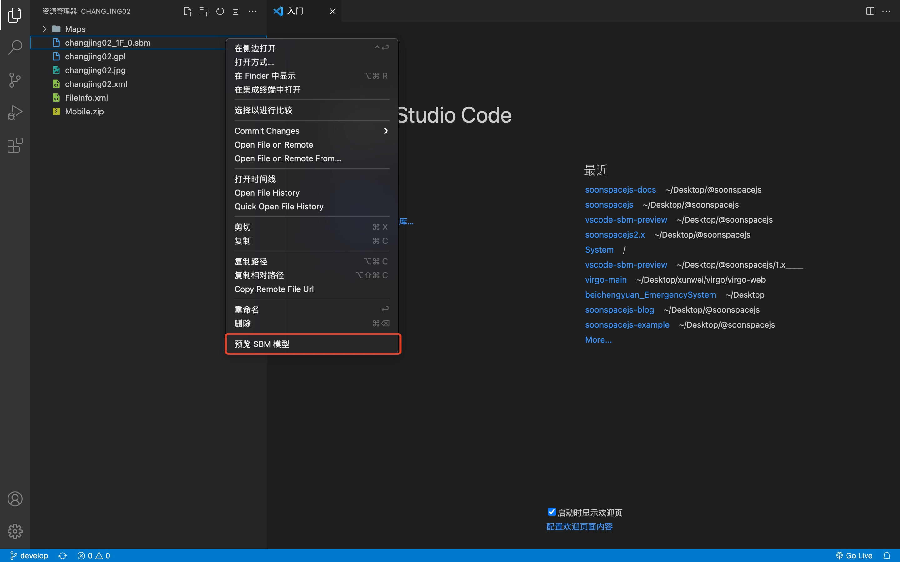
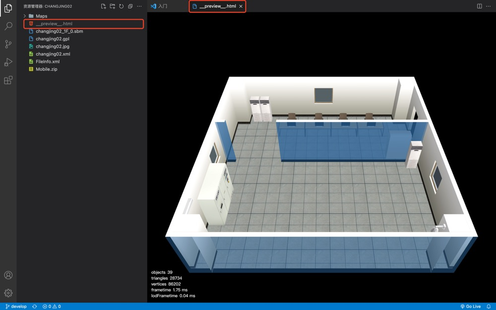

# vscode-sbm-preview
vscode 插件 - sbm 模型预览

::: warning 警告
部分早期模型文件由于版本问题，会出现无法预览问题。
:::

## 安装

在 `vscode` 插件商城搜索关键字 **sbm** 或 **soonspace** 找到如下图插件，点击安装。

## 使用

在文件后缀为 `.sbm` 的模型文件目录右键打开操作菜单，会显示 **预览 Sbm 模型** 功能项。

## 页面展示

点击功能项自动在模型文件同目录生成页面文件，同时启动本地服务打开页面预览。

