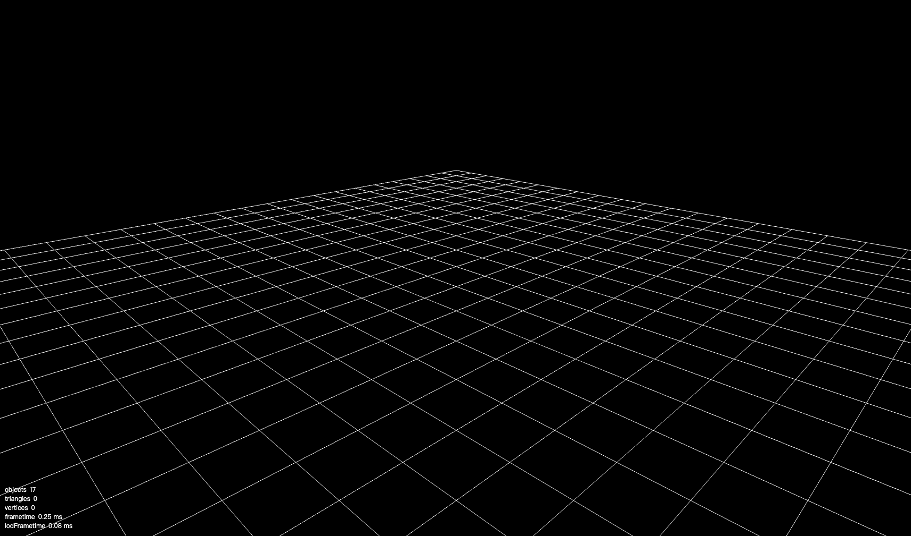
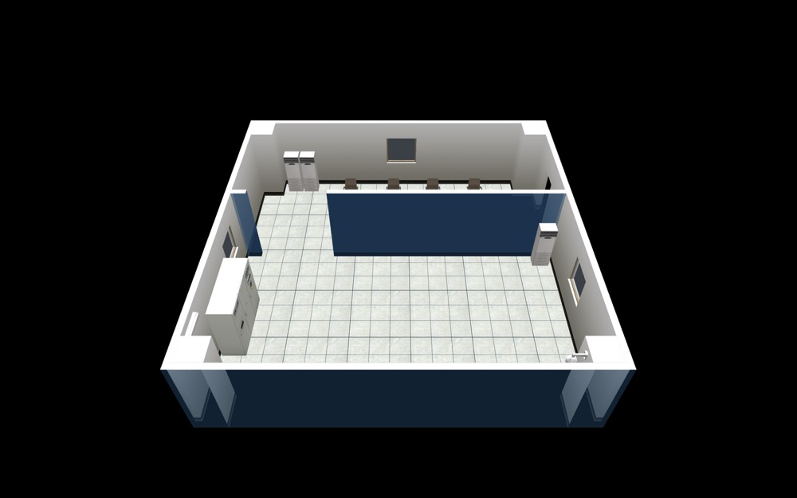
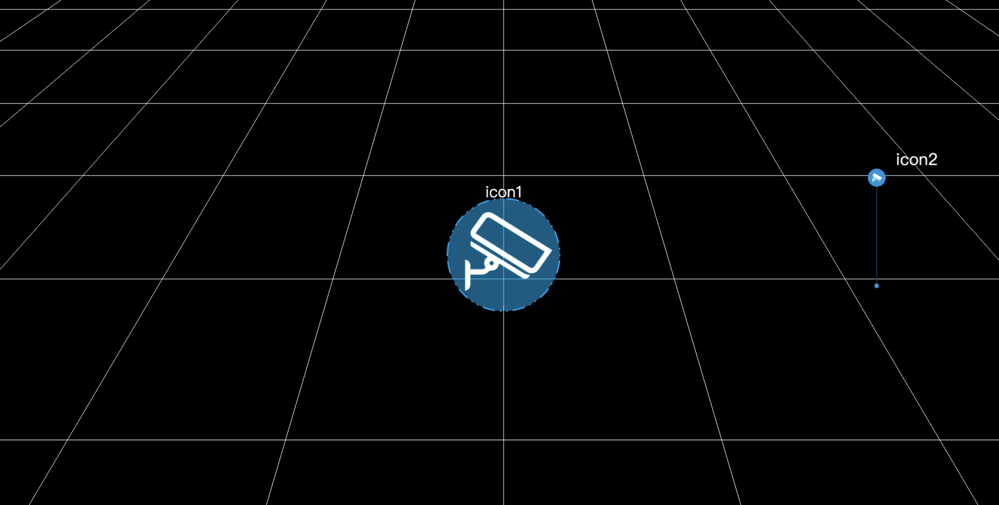
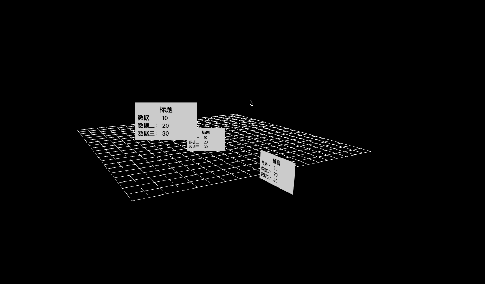
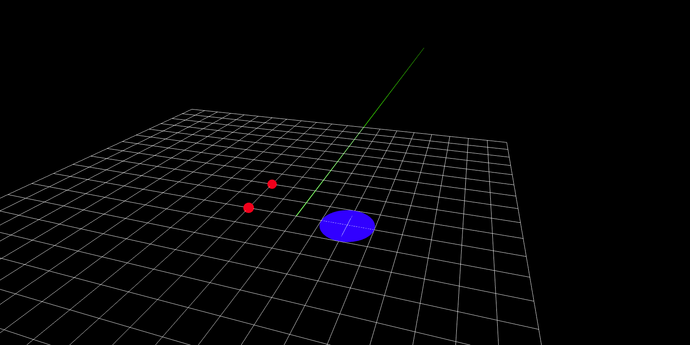
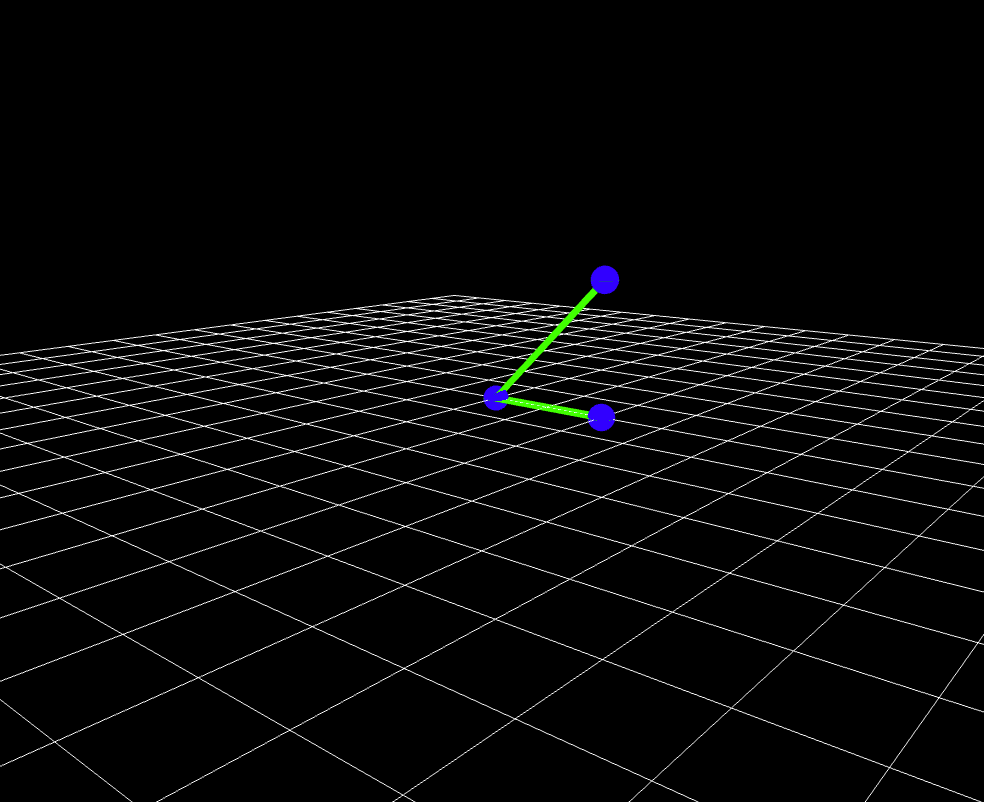
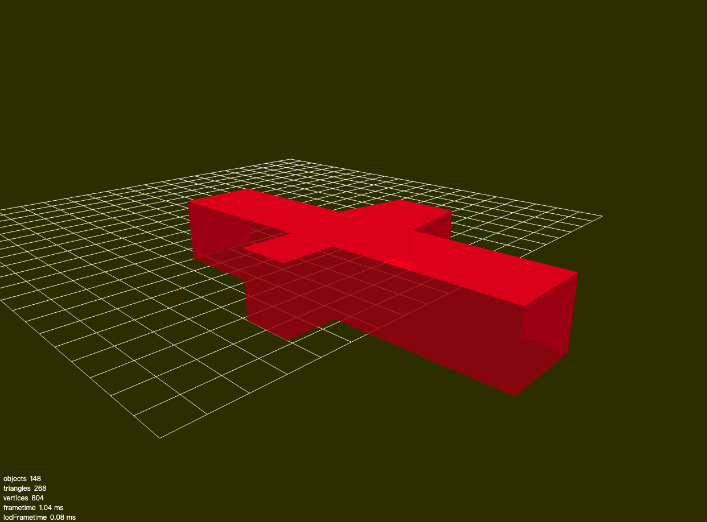
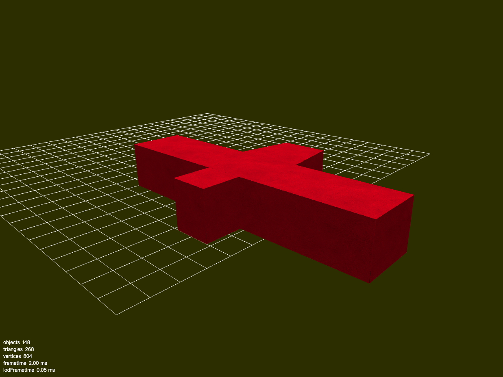
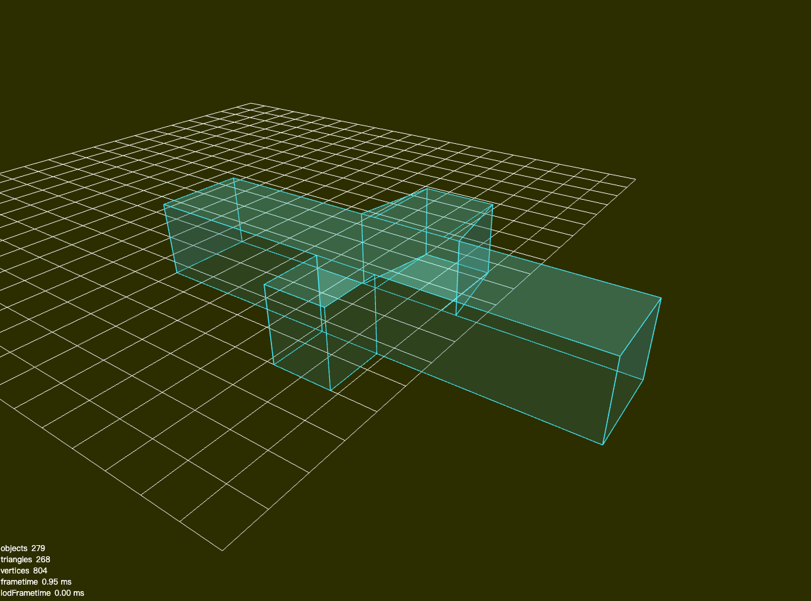
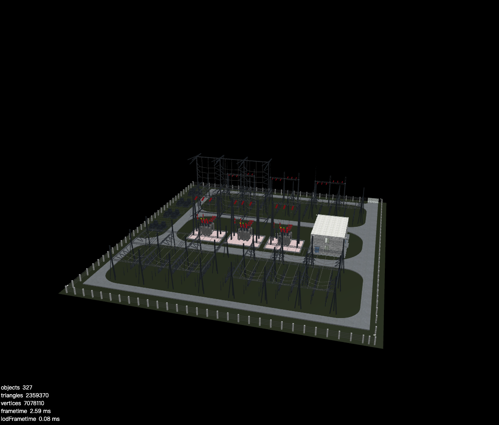

# SoonSpace.js 入门培训文档


## 目的

帮助开发者初步了解并快速上手 SoonSpace.js 开发流程。

文档只会列举部分常用基础方法，更高级用法请移步[官方文档：http://www.xwbuilders.com:9018/soonspacejs/Docs/2.x/](http://www.xwbuilders.com:9018/soonspacejs/Docs/2.x/)


## 简介

**SoonSpace.js** 是 [杭州迅维智能科技有限公司](http://www.xwbuilders.com/) 面向内部与客户  `BIM for web side`  开发包。

- 服务于 [SoonBuilder](http://www.xwbuilders.com/?page_id=1101&lang=zh)的特定文件格式  `.sbm`  模型的加载。
- 基于 [threejs](https://threejs.org/)封装， 简化其在业务层的开发使用。


## 安装

前置条件: 

- 安装 Node.js，[请参考官网](https://nodejs.org/en/)

通过 npm

```sh
npm install soonspacejs -S
# 或者
yarn add soonspacejs -S 
```

使用

```js
import SoonSpace from 'soonspacejs'
```


通过 CDN 链接

[https://unpkg.com/soonspacejs/dist/index.js](https://unpkg.com/soonspacejs/dist/index.js)

使用

```html
<script crossorigin src="https://unpkg.com/soonspacejs/dist/index.js"></script>
```


## 使用样例

> 以下样例都基于同一环境
>
> 外部资源、文件不做额外展示

```html
<!DOCTYPE html>
<html lang="en">

<head>
  <meta charset="UTF-8">
  <meta name="viewport" content="width=device-width, initial-scale=1.0">
  <meta http-equiv="X-UA-Compatible" content="ie=edge">
  <title>SoonSpace Example</title>
</head>

<body>

  <div id="view"></div>

  <script type="module">
    import SoonSpace from 'https://unpkg.com/soonspacejs/dist/index.esm.js'

    // coding here...
    
  </script>
</body>

</html>
```


### 常用 API

#### 1.1 初始化场景

```js
const ssp = window.ssp = new SoonSpace({
      // 绑定场景的元素选择器
      el: '#view',
      // 初始配置项
      options: {
        // 背景色
        background: {
          color: 'black',
          alpha: false
        },
        // 是否显示网格
        showGrid: true,
        // 是否显示左下角的加载数量信息
        showInfo: true
      },
      // 场景交互事件
      events: {}
    })
```

此时还未加载任何模型




#### 1.1.1 配置项

[文档：http://www.xwbuilders.com:9018/soonspacejs/Docs/2.x/guide/config.html](http://www.xwbuilders.com:9018/soonspacejs/Docs/2.x/guide/config.html)

#### 1.1.2 空间事件

[文档：http://www.xwbuilders.com:9018/soonspacejs/Docs/2.x/guide/event.html](http://www.xwbuilders.com:9018/soonspacejs/Docs/2.x/guide/event.html)

#### 1.1.3 完整 API

[文档：http://www.xwbuilders.com:9018/soonspacejs/Docs/2.x/api/](http://www.xwbuilders.com:9018/soonspacejs/Docs/2.x/api/)


#### 1.2 加载 sbm

```js
 const ssp = new SoonSpace({
   		// 只有 el 是必传的
      el: '#view',
    })

    ssp.loadSbm(
      // sbmInfo
      {
        id: 'room_01',
        url: '../../asstes/model/sbm/room/room.sbm'
      },
      // onProgress
      progress => console.log(progress)
    )
      .then(models => {
        // 模型加载完毕，飞向主视角
        ssp.flyMainViewpoint()
      })
      .catch(err => {
      	// 加载模型出错时
        console.error(err)
      })
```

加载了一个房间



#### 1.3 加载 POI

```js
const ssp = new SoonSpace({
      el: '#view',
      options: {
        showGrid: true,
      },
    })

    /**
     * createPoi
     */
    const poi = ssp.createPoi({
      id: "icon1",
      name: "icon1",
      url: "../../asstes/img/poi/WechatIMG709.png",
      position: {
        x: 0,
        y: 10,
        z: 0
      },
      level: {
        max: 5000,
        min: 10
      },
      scale: {
        x: 2,
        y: 2,
        z: 2
      }
    });

		// 飞向 POI
    ssp.flyToObj(poi)

    /**
     * 创建 POI 组与 创建 POI 效果上无区别，只是便于批量操作
     */
    const group = ssp.createPoiToGroup(
      {
        id: 'firstPoiGroup'
      },
      [{
        id: "icon2",
        name: "icon2",
        url: "../../asstes/img/poi/camera_poi_512.png",
        position: {
          x: 100,
          y: 20,
          z: 0
        },
        scale: {
          x: 2,
          y: 2,
          z: 2
        },
      }]
    )


```

创建了两个 Poi




#### 1.4 加载 POI Node

```js
 const ssp = new SoonSpace({
      el: '#view',
      options: {
        showGrid: true,
        showInfo: true
      },
    })
 // 创建 2D POI Node
  const poiNode = ssp.createPoiNode({
          type: '2D',
          id: '2DPoiNode',
          position: {
            x: -500,
            y: 0,
            z: 0
          },
          element: poiNodeEl
        })
   // 创建 2.5D POI Node
  const poiNode = ssp.createPoiNode({
          type: '2.5D',
          id: '2DPoiNode',
          position: {
            x: 0,
            y: 0,
            z: 0
          },
          element: poiNodeEl
        })
  // 创建 3D POI Node
  const poiNode = ssp.createPoiNode({
          type: '3D',
          id: '2DPoiNode',
          position: {
            x: 500,
            y: 0,
            z: 0
          },
          element: poiNodeEl
        })
```

分别创建了 2D、2.5D、3D 




#### 1.5 全局事件

```js
const ssp = new SoonSpace({
      el: '#view',
      options: {
        hoverEnabled: false
      },
      events: {
        sceneClick(param) {
          console.log('sceneClick', param)
        },
        modelClick(param) {
          console.log('modelClick', param)
        },
        modelRightClick(param) {
          console.log('modelRightClick', param)
        },
        modelDblClick(param) {
          console.log('modelDblClick', param)
        },
        modelHover(param) {
          // console.log('modelHover', param)
        },
        poiClick(poi) {
          console.log('poiClick', poi)
        },
        poiRightClick(poi) {
          console.log('poiRightClick', poi)
        },
        poiDblClick(poi) {
          console.log('poiDblClick', poi)
        },
        poiHover(poi) {
          // console.log('poiHover', poi)
        },
        selectPosition(position) {
          // console.log('selectPosition', position)
        }
      }
    })

 ssp.createPoi({
      id: "icon1",
      url: "../../asstes/img/poi/WechatIMG709.png",
      position: {
        x: 0,
        y: 300,
        z: 0
      },
      scale: {
        x: 10,
        y: 10,
        z: 1
      }
    });
```


#### 1.6 空间画布

```js
const ssp = window.ssp = new SoonSpace({
      el: '#view',
      options: {
        showGrid: true
      },
    })

    const canvas3D = ssp.createCanvas3D({
      id: 'test_canvas',
      points: [{
        id: 'point_1',
        radius: 10,
        color: 0xff0000,
        opacity: 1,
        position: {
          x: 0,
          y: 0,
          z: 0
        }
      }, {
        id: 'point_2',
        radius: 10,
        color: 0xff0000,
        opacity: 1,
        position: {
          x: 100,
          y: 0,
          z: 0
        }
      }],
      lines: [{
        id: 'line_1',
        start: {
          x: 0,
          y: 0,
          z: 100
        },
        end: {
          x: 2000,
          y: 0,
          z: 100
        },
        width: 2
      }],
      faces: [{
        id: 'face_1',
        points: [
          {
            x: 0,
            y: 0,
            z: 300,
          },
          {
            x: 100,
            y: 0,
            z: 300,
          },
          {
            x: 100,
            y: 0,
            z: 400,
          },
          {
            x: 0,
            y: 0,
            z: 400,
          }
        ],
        color: 0xffff00,
        opacity: .8
      }],
      circles: [{
        id: 'circle_1',
        radius: 50,
        color: 'blue',
        position: {
          x: 0,
          y: 0,
          z: 200
        },
        rotation: {
          x: Math.PI / 2,
          y: 0,
          z: 0
        }
      }]
    })
```

创建了一个点线面组合的空间画布




#### 1.7 拓扑路径

```js
   const ssp = new SoonSpace({
      el: '#view',
      options: {
        showGrid: true
      },
    })

    ssp.createTopology(
      {
        id: 'xx',
        name: 'xx',
        nodes: [{ x: 0, y: 0, z: 0 }, { x: 100, y: 0, z: 0 },{ x: 100, y: 100, z: 0 }],
        links: [{ pointAIndex: 0, pointBIndex: 1 },{ pointAIndex: 0, pointBIndex: 2 }],
      }
    )
```




### 模型操作

#### 2.1 模型透明

```js
const ssp = window.ssp = new SoonSpace({
      el: '#view',
      options: {
        background: {
          color: '#333300'
        },
        showInfo: true,
        showGrid: true,
      },
    })
 ssp.loadSbm({
      id: 'v1_1',
      url: './model/sbm/v2/drain-pipe03/drain-pipe03_1F_0.sbm',
      position: {
        x: 100,
        y: 0,
        z: 100
      },
    })
      .then(sbm => {
   			// 模型加载完毕
        ssp.flyToObj(sbm, "current")
				// 模型透明
        ssp.opacityShow(sbm)
      })
```



#### 2.2 模型高亮

```js
// 同上 
ssp.highlightShow(sbm)
```



#### 2.2 模型描边

```js
// 同上
ssp.strokeShow(sbm)
```




### 插件使用

目前官方提供的插件功能有：`热力图`、`第一人巡检`、`场景切割控制器`、`模型操作控制器`、`鼠标跟随控制器`、`导航路径自动巡检`、`空间平台协同插件`

#### 3.1 使用示例

```js
import SoonSpace from 'soonspacejs'
import FollowMousePlugin from '@soonspacejs/plugin-follow-mouse'

const ssp = new SoonSpace({
  el: '#view',
  options: {},
  event: {}
})

// 以热力图插件为示例
const followMousePlugin = ssp.registerPlugin(FollowMousePlugin, 'followMousePlugin')
consolo.log(followMousePlugin)
```


#### 3.2 soonmanager-sync 的使用

 [空间平台](http://www.xwbuilders.com:9050/#/projectManage/bim)生产的场景加载及数据读取插件。

##### 安装

```sh
npm install @soonspacejs/plugin-soonmanager-sync -S
# or
yarn add @soonspacejs/plugin-soonmanager-sync -S
```

##### 使用

```js
import SoonSpace from 'soonspacejs';
import SoonmanagerSyncPlugin from '@soonspacejs/plugin-soonmanager-sync';

const ssp = new SoonSpace({
  el: '#view',
  options: {},
  event: {},
});

const soonmanagerSync = ssp.registerPlugin(
  SoonmanagerSyncPlugin,
  'soonmanagerSync'
);
// 设置基础路径，这个路径是后台资源地址
soonmanagerSync.setBaseUrl('./data2/')
// 同步背景、环境光、平行光、雾化效果
soonmanagerSync.setGlobalSetting()
// 根据 baseUrl 加载模型
soonmanagerSync.loadScene({
       syncLoad: true,
       LoadsPerSecond: 60,
     })
	.then(() => {
  	console.log("全部模型加载成功");
		ssp.flyMainViewpoint()
})
```



详细文档请参阅 [http://www.xwbuilders.com:9018/soonspacejs/Docs/2.x/plugin/soonmanager-sync.html](http://www.xwbuilders.com:9018/soonspacejs/Docs/2.x/plugin/soonmanager-sync.html)

